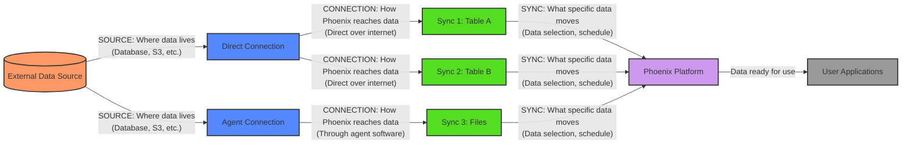

```mermaid
graph LR
    %% Define the nodes
    DB[(External Data Source)]
    C1[Direct Connection]
    C2[Agent Connection]
    S1[Sync 1: Table A]
    S2[Sync 2: Table B]
    S3[Sync 3: Files]
    P[Phoenix Platform]
    U[User Applications]
    
    %% Define the edges with descriptions
    DB -->|"SOURCE: Where data lives\n(Database, S3, etc.)"| C1
    DB -->|"SOURCE: Where data lives\n(Database, S3, etc.)"| C2
    
    C1 -->|"CONNECTION: How Phoenix reaches data\n(Direct over internet)"| S1
    C1 -->|"CONNECTION: How Phoenix reaches data\n(Direct over internet)"| S2
    
    C2 -->|"CONNECTION: How Phoenix reaches data\n(Through agent software)"| S3
    
    S1 -->|"SYNC: What specific data moves\n(Data selection, schedule)"| P
    S2 -->|"SYNC: What specific data moves\n(Data selection, schedule)"| P
    S3 -->|"SYNC: What specific data moves\n(Data selection, schedule)"| P
    
    P -->|"Data ready for use"| U
    
    %% Styling
    classDef source fill:#f96,stroke:#333,stroke-width:2px;
    classDef connection fill:#58f,stroke:#333,stroke-width:2px;
    classDef sync fill:#5d2,stroke:#333,stroke-width:2px;
    classDef platform fill:#c9e,stroke:#333,stroke-width:2px;
    classDef user fill:#999,stroke:#333,stroke-width:2px;
    
    class DB source;
    class C1,C2 connection;
    class S1,S2,S3 sync;
    class P platform;
    class U user;
```
