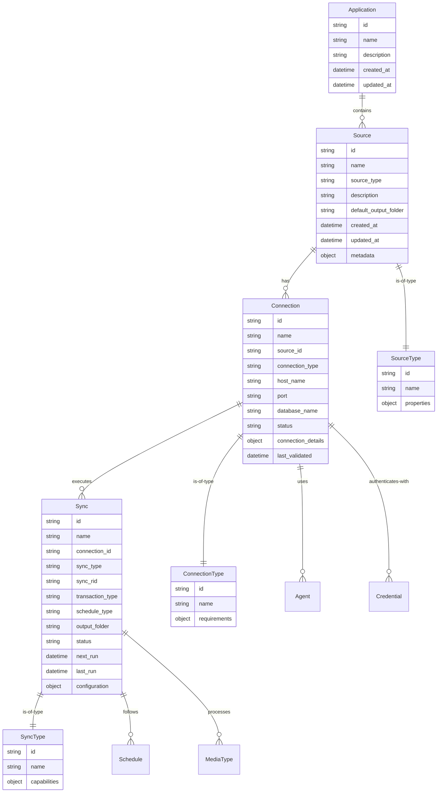

# Data Connection Entities

[← Back to Data Connection](./index.md)

This document provides a comprehensive overview of the core entities that comprise the Phoenix Data Connection system, based on the architectural mindmap. Understanding these entities and their relationships is essential for effectively configuring and managing data integration workflows.

## Entity Overview

The Phoenix Data Connection system is built around a hierarchical structure of **Sources → Connections → Syncs** that enables seamless data integration. These entities represent the fundamental building blocks for connecting, transforming, and managing data flows between external systems and Phoenix.



## Core Entities

### 1. Application
**Description**: Top-level container that groups related data sources and configurations for a specific business purpose or project.

**Key Attributes**:
- `id`: Unique identifier for the application
- `name`: Human-readable application name  
- `description`: Detailed description of the application's purpose
- `created_at`: Application creation timestamp
- `updated_at`: Last modification timestamp

**Relationships**:
- Contains multiple Sources
- Provides organizational context for data connections

**Use Cases**:
- Organizing data connections by business unit or project
- Isolating development, staging, and production environments  
- Managing access control and permissions at the application level

---

### 2. Source
**Description**: Represents an external data system that can be connected to Phoenix. Sources define the type of system and basic configuration for establishing connections.

**Key Attributes**:
- `id`: Unique source identifier
- `name`: Descriptive source name
- `source_type`: Type of data source (see Source Types below)
- `description`: Purpose and context of the source
- `default_output_folder`: Default path for data output
- `metadata`: Additional properties specific to source type

**Relationships**:
- Belongs to an Application
- Has multiple Connections
- Associated with a SourceType

**Source Types**:
- **Streaming Data Systems**: Apache Kafka, Amazon Kinesis
- **Cloud Object Storage**: Amazon S3, Azure Data Lake Storage Gen2, Google Cloud Storage
- **Relational Databases**: PostgreSQL, SQL Server, Oracle, Snowflake, MySQL

**Source Configuration**:
- Default output folder settings
- Source-specific metadata and properties
- Preview and exploration capabilities
- Connection type preferences (Direct vs Agent)

---

### 3. Connection
**Description**: Represents a configured connection to a specific Source, including authentication, network settings, and connection parameters.

**Key Attributes**:
- `id`: Unique connection identifier
- `name`: Descriptive connection name
- `source_id`: Reference to parent Source
- `connection_type`: Direct Connection or Through an Agent
- `host_name`: Server hostname or IP address
- `port`: Connection port number
- `database_name`: Database or service name (if applicable)
- `status`: Connection status (active, inactive, error, configuring)
- `connection_details`: Detailed configuration object
- `last_validated`: Last successful connection test

**Relationships**:
- Belongs to a Source
- Has multiple Syncs
- Uses Credentials for authentication
- May use an Agent for connectivity

**Connection Types**:

#### Direct Connection
- Direct network access to source systems
- Phoenix platform connects directly to external system
- Suitable for cloud-accessible systems
- Requires network connectivity from Phoenix to source

#### Through an Agent  
- Connection through customer-deployed agent
- Agent provides secure tunnel and local processing
- Suitable for on-premises or restricted network environments
- Supports agent restart methods (immediate, after syncs complete, manual)

**Connection Configuration**:
- Host type selection (Hostname or IPv4)
- Port and database configuration
- Authentication settings
- Agent selection and configuration (if applicable)
- Network and security settings

---

### 4. Sync
**Description**: Defines how data should be synchronized between a Connection and Phoenix, including scheduling, data processing, and output configuration.

**Key Attributes**:
- `id`: Unique sync identifier
- `name`: Descriptive sync name
- `connection_id`: Reference to parent Connection
- `sync_type`: Type of synchronization (see Sync Types below)
- `sync_rid`: Runtime identifier for sync execution
- `transaction_type`: How data changes are handled (Snapshot, Append, Update)
- `schedule_type`: When sync executes (Manual, Scheduled, Event-Triggered)
- `output_folder`: Destination path for synchronized data
- `status`: Current sync status
- `next_run`: Scheduled next execution time
- `last_run`: Last execution timestamp
- `configuration`: Sync-specific settings and parameters

**Relationships**:
- Belongs to a Connection
- Has a SyncType definition
- Follows a Schedule (if not manual)
- May process specific MediaTypes

**Sync Types**:

#### CDC Sync (Change Data Capture)
- Captures and replicates database changes in real-time
- Tracks inserts, updates, and deletes
- Suitable for relational databases with CDC capabilities

#### Streaming Sync
- Continuous data flow from streaming systems
- Real-time data processing and ingestion
- Suitable for Kafka, Kinesis, and other streaming platforms

#### Virtual Table
- Query external data without copying to Phoenix
- Data remains in source system
- Suitable for read-only access patterns

#### Media Sync  
- Synchronization of media files and documents
- Supports multiple file formats and types
- Includes format conversion and processing capabilities

#### Batch Sync
- Scheduled data transfers in batches
- Traditional ETL-style data movement
- Suitable for periodic data updates

#### Agent Sync
- Sync execution through deployed agents
- Processing occurs on customer infrastructure
- Suitable for sensitive data or complex transformations

**Transaction Types**:
- **Snapshot**: Complete data replacement
- **Append**: Add new records only  
- **Update**: Merge changes with existing data

**Schedule Types**:
- **Manual**: Execute on-demand only
- **Scheduled**: Run on defined schedule (daily, hourly, etc.)
- **Event-Triggered**: Execute based on external events

---

### 5. Schedule
**Description**: Defines when and how frequently synchronization operations should be executed, supporting various scheduling patterns.

**Key Attributes**:
- `id`: Unique schedule identifier
- `pattern`: Schedule frequency (Run every X days/hours)
- `time`: Execution time (e.g., "12:00 AM")
- `timezone`: Timezone for schedule execution (e.g., "Los Angeles(PDT) -07:00")
- `enabled`: Schedule activation status
- `next_run`: Calculated next execution time

**Schedule Examples**:
- "Run every 1 day at 12:00 AM [Los Angeles(PDT) -07:00]"
- "Run every 6 hours"
- "Manual execution only"

---

### 6. MediaType
**Description**: Classification and configuration for different types of media files that can be processed by media syncs.

**Media Categories**:

#### Audio Formats
- `.MP3`: MPEG-1 Audio Layer III
- `.WAV`: Waveform Audio File Format  
- `.FLAC`: Free Lossless Audio Codec
- `.OGG`: Ogg Vorbis audio format

#### Document Formats  
- `.TXT`: Plain text files
- `.ZIP`: Compressed archive files
- `.PDF`: Portable Document Format
- `.DOCX`: Microsoft Word documents

#### Image Formats
- `.JPEG`: Joint Photographic Experts Group
- `.PNG`: Portable Network Graphics
- `.TIFF`: Tagged Image File Format
- `.SVG`: Scalable Vector Graphics

#### Video Formats
- `.MP4`: MPEG-4 video format
- `.MKV`: Matroska video format
- `.WebM`: WebM video format
- `.MOV`: QuickTime movie format

**Media Configuration**:
- Format selection and filtering
- File size and quality settings
- Processing and conversion options
- Output format specifications

---

### 7. Agent
**Description**: Software component deployed in customer infrastructure to provide secure connectivity and processing capabilities for restricted network environments.

**Key Attributes**:
- `id`: Unique agent identifier
- `name`: Agent deployment name
- `version`: Installed agent version
- `host_info`: Host system information
- `last_heartbeat`: Last communication timestamp
- `connection_status`: Current connectivity state

**Agent Capabilities**:
- Secure tunnel creation for database connections
- Local data processing and transformation
- Credential management and security
- Health monitoring and diagnostics

**Agent Restart Methods**:
- **Restart immediately**: Immediate agent restart
- **Restart after running syncs are complete**: Graceful restart
- **Restart later, manually**: Manual restart control

---

### 8. Credential  
**Description**: Secure storage and management of authentication information required to access external systems.

**Key Attributes**:
- `id`: Unique credential identifier
- `name`: Descriptive credential name
- `type`: Authentication type
- `encrypted_value`: Securely stored credential data
- `expiration_date`: Credential expiration (if applicable)

**Authentication Types**:
- **Username/Password**: Traditional database authentication
- **SSL**: SSL certificate-based authentication
- **SSL+SASL**: Combined SSL and SASL authentication
- **None**: No authentication required

**Security Features**:
- Encryption at rest and in transit
- Role-based access control
- Credential rotation support
- Audit logging for access

---

## Entity Relationships and Workflows

### Primary Hierarchy
```
Application
└── Source (PostgreSQL, Kafka, S3, etc.)
    └── Connection (Direct or Through Agent)
        └── Sync (CDC, Streaming, Media, Batch, Virtual Table)
```

### Configuration Flow
1. **Create Source**: Choose source type and configure basic settings
2. **Establish Connection**: Configure connection details and authentication  
3. **Set Up Syncs**: Define synchronization rules and scheduling
4. **Monitor and Manage**: Track execution and performance

### Data Flow
1. **Source Discovery**: Explore available data in external systems
2. **Connection Validation**: Test and verify connectivity
3. **Sync Execution**: Process and transfer data according to configuration
4. **Output Management**: Store synchronized data in specified locations

### Navigation Patterns
- **Source Overview**: Summary of connections and sync status
- **Connection Details**: Configuration and sync management
- **Sync Configuration**: Schedule, format, and processing settings
- **Explore Source**: Preview and browse source data

## Tabs and Views

### Source Tabs
- **Overview**: Source summary and connection list
- **Explore Source**: Data preview and exploration tools
- **Connection Settings**: Network and authentication configuration

### Connection Tabs  
- **Overview**: Connection status and sync summary
- **Connection Details**: Host, port, and authentication settings
- **Edit Syncs**: Manage synchronization configurations

### Sync Tabs
- **Configuration**: Sync type, schedule, and processing settings
- **Properties**: Metadata and execution history
- **Output**: Destination and format configuration

## Best Practices

### Entity Organization
- Group related sources under logical applications
- Use descriptive names that indicate purpose and environment
- Maintain consistent naming conventions across entities

### Connection Management
- Test connections before creating syncs
- Monitor connection health and performance
- Implement proper credential rotation

### Sync Configuration
- Choose appropriate sync types for data characteristics
- Configure reasonable schedules to avoid system overload
- Monitor sync performance and adjust as needed

### Security Considerations
- Use agent connections for sensitive or restricted environments
- Implement proper credential management
- Regularly review and audit access permissions

---

**Next**: [Business Workflows](./business-workflows.md) | **Previous**: [Data Connection Overview](./index.md)