# Data Connection: A Complete User Guide for Beginners

> **Editor's Note**: Throughout this document, you'll see references to Figma node IDs in square brackets [Figma node ID: XXXXX]. These IDs are included to help connect documentation sections with their corresponding design elements in Figma. The main Figma file link is [https://www.figma.com/design/HflEwuvYPccr7xSFobduyh/Phoenix---Main-File](https://www.figma.com/design/HflEwuvYPccr7xSFobduyh/Phoenix---Main-File?node-id=5546-71376&m=dev). Some images in this document may be placeholders that will be replaced with actual screenshots during final production.

## Part 1: Introduction to Data Connection

### What is Data Connection?

Data Connection is an application within Phoenix that helps you bring your data from outside systems into Phoenix. Think of it as a bridge between your existing data (stored in databases, cloud storage, or other systems) and Phoenix where you can analyze and work with that data.

**In simple terms**: Data Connection lets you connect to your data, wherever it lives, and bring it into Phoenix so you can use it.

### Why Use Data Connection?

- **Access all your data in one place**: Instead of switching between different systems to access different data, bring everything into Phoenix
- **Keep data up-to-date automatically**: Set up regular updates so your Phoenix data stays fresh
- **Maintain security and permissions**: Connect to external data while maintaining proper security controls
- **No coding required**: Use a friendly interface instead of writing complex code to connect data sources

### What You Can Do With Data Connection

- Connect to databases like Snowflake, PostgreSQL, or SQL Server
- Pull data from cloud storage like Amazon S3 or Google Cloud Storage
- Import files from local systems
- Connect to web-based data through APIs
- Set up automatic, regular data updates
- Preview data before bringing it into Phoenix

### Visual Flow Overview

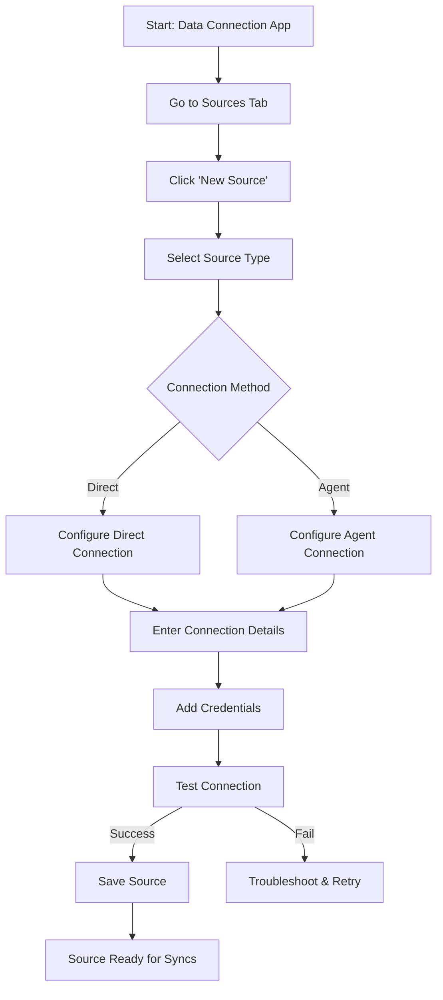
```mermaid
flowchart TD
    Start[Start: Data Connection App] --> SourcesTab[Go to Sources Tab]
    SourcesTab --> NewSource[Click 'New Source']
    NewSource --> SelectType[Select Source Type]
    SelectType --> ChooseMethod{Connection Method}
    ChooseMethod -->|Direct| DirectConfig[Configure Direct Connection]
    ChooseMethod -->|Agent| AgentConfig[Configure Agent Connection]
    DirectConfig --> EnterDetails[Enter Connection Details]
    AgentConfig --> EnterDetails
    EnterDetails --> AddCredentials[Add Credentials]
    AddCredentials --> TestConn[Test Connection]
    TestConn -->|Success| SaveSource[Save Source]
    TestConn -->|Fail| Troubleshoot[Troubleshoot & Retry]
    SaveSource --> Done[Source Ready for Syncs]
```

---

## Part 2: Getting Started

### Accessing Data Connection

1. **Find Data Connection** in the navigation sidebar (usually represented by a database icon)
2. **Click on the Data Connection icon** to open the application

### The Data Connection Home Screen

When you first open Data Connection, you'll see a dashboard that looks like this:

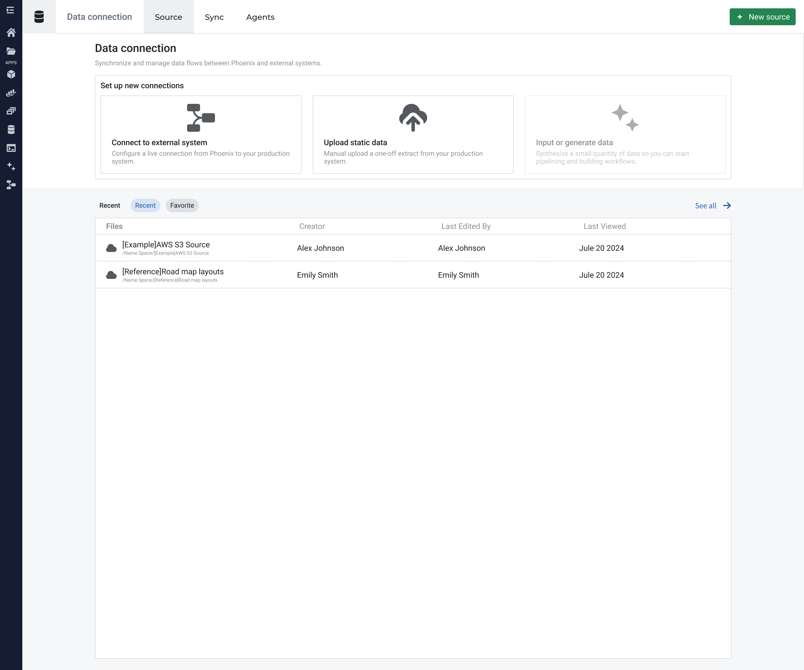
*The Data Connection home screen with main sections highlighted* [Figma node ID: 11415:21880]

The home screen has several important areas:

#### 1. Navigation Tabs [Figma node ID: 11415:21883]
At the top of the screen, you'll see navigation tabs that help you move between different areas of the Data Connection app:
- **Sources**: View and manage all your data source connections
- **Syncs**: View and manage your data synchronization jobs 
- **Agents**: View and manage connection agents if you use them

Each tab has a clear count indicator showing the number of items in that category. The currently selected tab is highlighted, allowing you to quickly identify which section you're viewing. These tabs allow you to quickly switch between managing your sources, syncs, and agents in one place.

#### 2. New Source Button [Figma node ID: I11415:21883;12:22271]
Located in the top-right corner, this prominent green button is how you start the process of adding a new data connection.


*The New Source button in the top-right corner of the interface*

Clicking this button will launch the source creation wizard that guides you through connecting to a new data source.

#### 3. Set Up New Connections Section [Figma node ID: 11415:21889]
This section displays categorized cards showing different types of data sources you can connect to:

1. **Database Connections**:
   - PostgreSQL
   - MongoDB
   - Snowflake
   - And other database types

2. **Cloud Services**:
   - Amazon S3
   - Google Cloud Storage
   - REST API connections

3. **File Sources**:
   - CSV/Excel files
   - JSON data
   - Other file formats

Each card provides a quick way to start connecting to that specific category of data sources. When clicked, they take you directly to the relevant section of the source creation wizard.

#### 4. Recent Sources [Figma node ID: recent-sources-section]
This section shows a list of data sources you've recently created or worked with. For each source, you can see:
- Source name
- Source type (indicated by an icon)
- Status of the connection
- Last updated timestamp

This makes it easy to quickly return to sources you're actively working with.

## Part 3: Understanding Key Concepts

### Three Key Terms You Need to Know

Before we go further, let's understand three important terms that you'll see throughout the Data Connection app:

#### 1. Sources
A **source** is simply where your data currently lives. This could be:
- A database like PostgreSQL or Snowflake
- Cloud storage like Amazon S3
- Files on a server
- A web-based service with an API

Think of a source as the "what" - what system contains your data?

#### 2. Connections
A **connection** is how Phoenix reaches your data source. There are two main types:

- **Direct connection**: Phoenix connects directly to your data source through the internet
  
  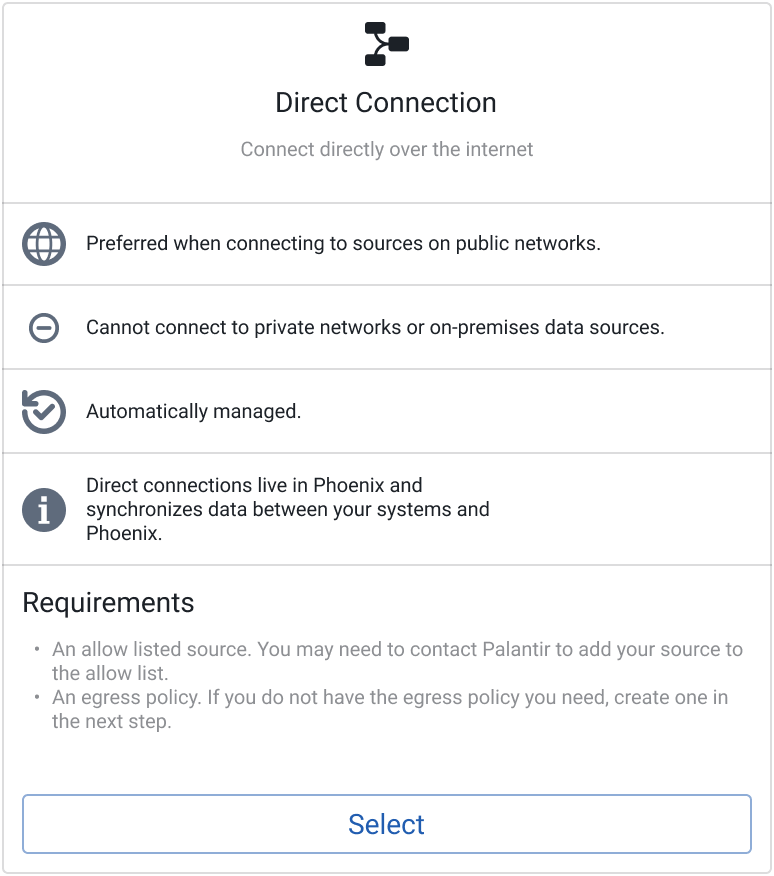
  *Direct connection between Phoenix and your data source* [Figma node ID: 13058:69615]
  
  **When to use direct connections:**
  - Best for data sources on public networks
  - Automatically managed by Phoenix
  - Requires an allow-listed source (you may need to contact support to add your source)
  - Cannot connect to private networks or on-premises data sources
  - Requires an egress policy (can be created during setup if needed)

- **Agent-based connection**: A small program (agent) installed in your network connects to your data and then to Phoenix
  
  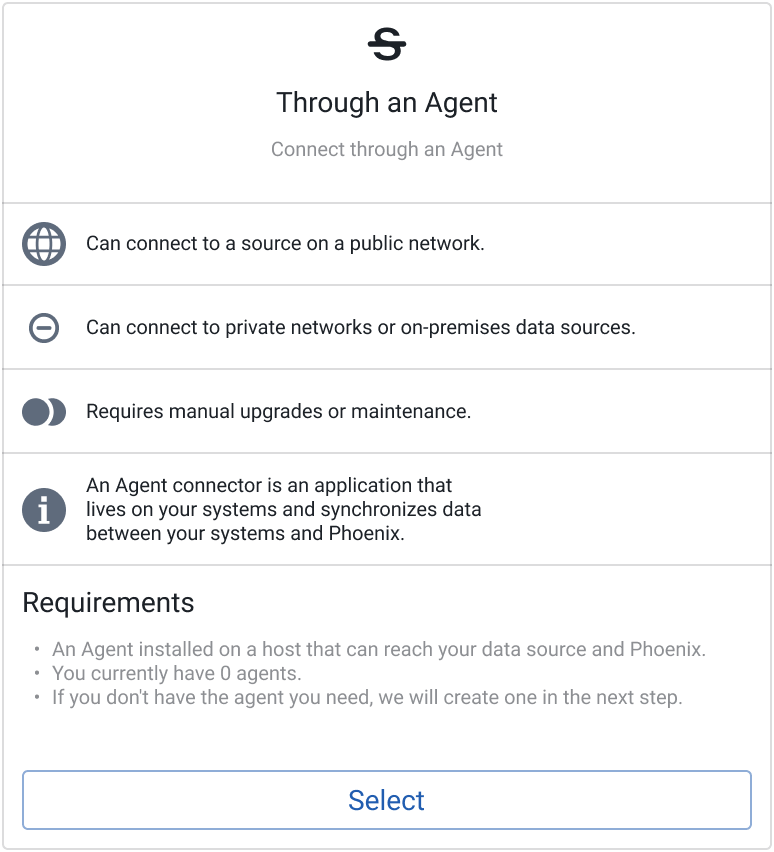
  *Agent connection between Phoenix and your data source* [Figma node ID: 13058:69642]
  
  **When to use agent connections:**
  - Can connect to both public networks and private/on-premises data sources
  - Requires manual upgrades or maintenance
  - Requires an agent installed on a host that can reach both your data source and Phoenix
  - Good option when your data is behind a firewall or in a private network

Think of a connection as the "how" - how does Phoenix reach your data?

#### 3. Syncs
A **sync** defines what specific data you want to bring into Phoenix and how often. For example:
- A specific table from a database
- A folder of files from cloud storage
- Data that matches specific criteria

You can set up multiple syncs from a single source to bring in different data.

Think of a sync as the "which" - which exact data do you want and when?

#### Visual Summary: User Workflow
Here's the complete workflow from starting a connection to using your data in Phoenix:

```
┌────────────────┐      ┌────────────────┐      ┌────────────────┐      ┌────────────────┐
│  HOME PAGE     │      │ SOURCE SELECT   │      │  CONNECTION    │      │  DATA USAGE    │
│                │      │                │      │   SETUP        │      │                │
│ • Landing page │──────> • Choose source │──────> • Configure    │──────> • Explore data │
│ • New source   │      │ • Select from  │      │   connection   │      │ • Create syncs │
│   button       │      │   categories   │      │ • Test & verify│      │ • Use in apps  │
│ • Quick setup  │      │ • Search for   │      │ • Set output   │      │ • Monitor and  │
│   cards        │      │   source types │      │   location     │      │   manage       │
└────────────────┘      └────────────────┘      └────────────────┘      └────────────────┘
```

**User Workflow Steps:**

1. **HOME PAGE**: Your starting point in Data Connection
   - View the Data Connection landing page with sources, syncs, and agents tabs
   - Click the "New source" button or use a Quick Setup card
   - See your recent sources and their status

2. **SOURCE SELECTION**: Choose what type of source to connect to
   - Browse through categories of data sources (databases, cloud storage, etc.)
   - Use the search bar to find specific source types
   - Select the card for your desired source type

3. **CONNECTION SETUP**: Configure and test your connection
   - Choose a connection method (Direct or Agent-based)
   - Name your source and select a project
   - Enter connection details specific to your source type
   - Test the connection and verify access
   - Configure output location for your data

4. **DATA USAGE**: Work with your connected data
   - Explore available data (tables, files, etc.)
   - Create syncs to bring specific data into Phoenix
   - Use the data in Phoenix applications
   - Monitor sync status and manage your connections

This workflow shows your complete journey from connecting to a data source to actively using that data in Phoenix.

## Part 4: Step-by-Step: Creating Your First Source

### Creating a New Source: Step-by-Step

Now that you understand the basic concepts, let's walk through creating your first data source connection:

#### Step 1: Start the Source Creation Process
1. From the Data Connection home screen, click the green **"New source"** button in the top-right corner
   
   1. Click the **New source** button in the top-right corner of the interface

2. This will open the source creation wizard, which guides you through the process

#### Step 2: Select Your Source Type
You'll see a screen showing different types of data sources you can connect to:

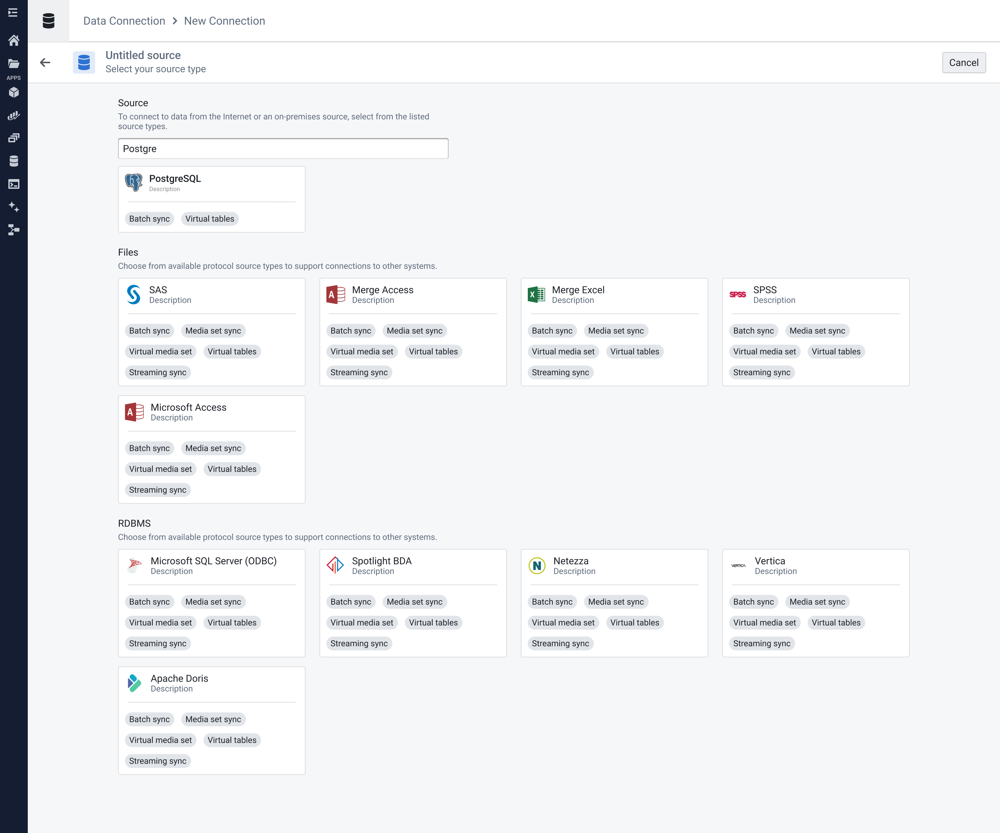
*The source type selection screen with search functionality* [Figma node ID: 11415:22299]

At this stage, the header will display "New Connection" as the default name until you provide a custom name in Stage 3.

This screen provides:
1. A search bar at the top where you can type to find specific data sources quickly (e.g., typing "postgre" will filter to show PostgreSQL)
2. Categories on the left side to browse by data source type:
   - Databases 
   - Cloud Storage
   - File Systems
   - Analytics
   - Business Applications
   - APIs and Web Services
3. Cards for each data source with their logo and name

Common source types in each category include:
- **Databases**: 
  - PostgreSQL
  - MongoDB
  - MySQL/MariaDB
  - Oracle Database
  - SQL Server
  - Snowflake
  - Redis
  
- **Cloud Storage**: 
  - Amazon S3
  - Google Cloud Storage
  - Azure Blob Storage
  - Box
  - Dropbox
  
- **File Systems**: 
  - Local Files
  - Network Shared Drive
  - SFTP/FTP Server
  - CSV/Excel Files
  
- **Analytics**: 
  - Google Analytics
  - Adobe Analytics
  - Mixpanel
  - Amplitude
  
- **Business Applications**: 
  - Salesforce
  - SAP
  - Workday
  - Microsoft Dynamics
  - HubSpot
  
- **APIs and Web Services**: 
  - REST API
  - GraphQL
  - SOAP Web Services

Hover over each card to see a brief description of the source type. Click on the type of source you want to connect to.

### The 6-Stage Source Creation Process

After selecting your source type, you'll enter a guided 6-stage process to set up your connection. At any time, you can track your progress using the stage indicator at the top of the screen:

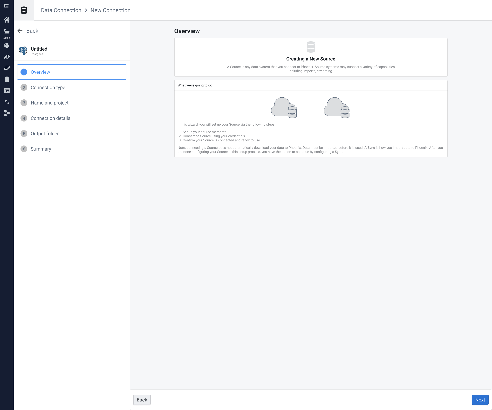
*Stage 1: Connection overview screen with 6-stage indicator at top* [Figma node ID: 11415:22244]

#### Stage 1: Overview
The first stage provides an overview of the connection process and what information you'll need to successfully create your source. At this point, your connection is labeled "Untitled" until you provide a name in Stage 3.


*Stage 1: Connection overview screen showing "Untitled" name* [Figma node ID: 11415:22253]

This screen provides a wizard introduction explaining the source setup process:

"In this wizard, you will set up your Source via the following steps:
- Set up your source metadata
- Connect to Source using your credentials
- Confirm your Source is connected and ready to use

Note: connecting a Source does not automatically download your data to Phoenix. Data must be imported before it is used. A Sync is how you import data to Phoenix. After you are done configuring your Source in this setup process, you have the option to continue by configuring a Sync."

The screen also includes:
1. **Required information**: A checklist of details you'll need (varies by source type)
2. **Connection timeline**: Shows the 6 stages you'll go through
3. **Back button**: Return to source type selection if needed
4. **Continue button**: Proceed to the next stage

#### Stage 2: Choose Connection Method

You'll need to select how Phoenix will connect to your data source:

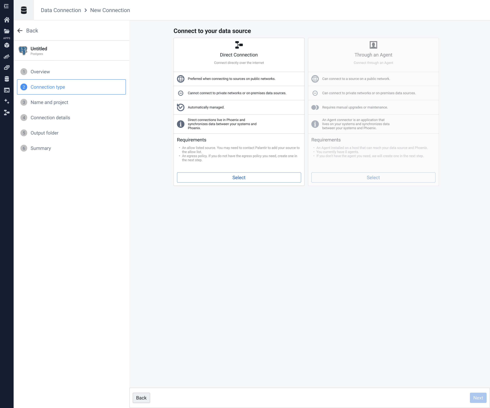
*Stage 2: Choosing between direct and agent-based connection* [Figma node ID: 11415:22153]

You have two main options, though depending on the source type you selected, some connection methods may be inactive (grayed out) if they're not supported for that particular data source:

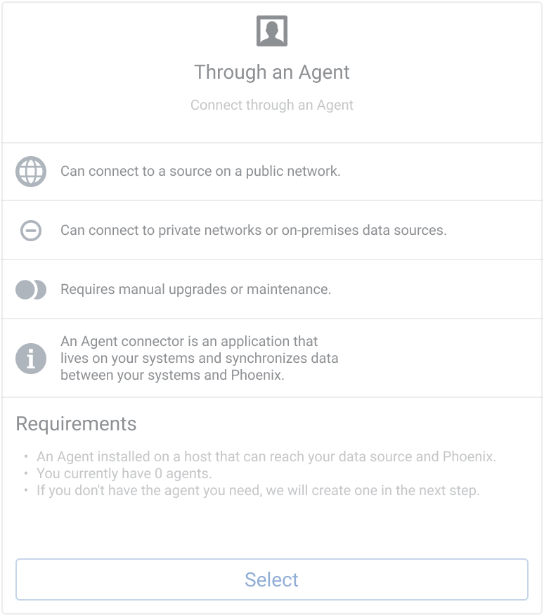
*Stage 2: Some connection methods may be inactive (grayed out) for certain source types* [Figma node ID: 11415:22214]

For example, some specialized data sources may only work with direct connections, while others might require an agent. The system will automatically show which options are available for your selected source type.

The available options are:

- **Direct connection**: Phoenix connects directly to your data source
  
  *Direct connection option with benefits listed* [Figma node ID: 11415:22153]

  - Simpler setup with no additional components to install
  - Works for sources that are accessible from Phoenix's network
  - Requires the data source to be network-accessible to Phoenix
  - Best for cloud databases, SaaS applications, and public APIs
  - The connection is made directly from Phoenix to your data source

- **Agent-based connection**: Uses a connection agent you install in your network
  
  *Agent-based connection option with benefits listed* [Figma node ID: 11415:22153]

  - Works with both public and private/on-premises data sources
  - Requires installing a connection agent in your environment
  - Provides enhanced security as Phoenix doesn't directly access your data
  - Necessary for accessing data behind firewalls or in private networks
  - Best for on-premises databases, internal systems, and restricted resources
  - The connection flows from your data source → connection agent → Phoenix

After making your selection, the option will be highlighted:

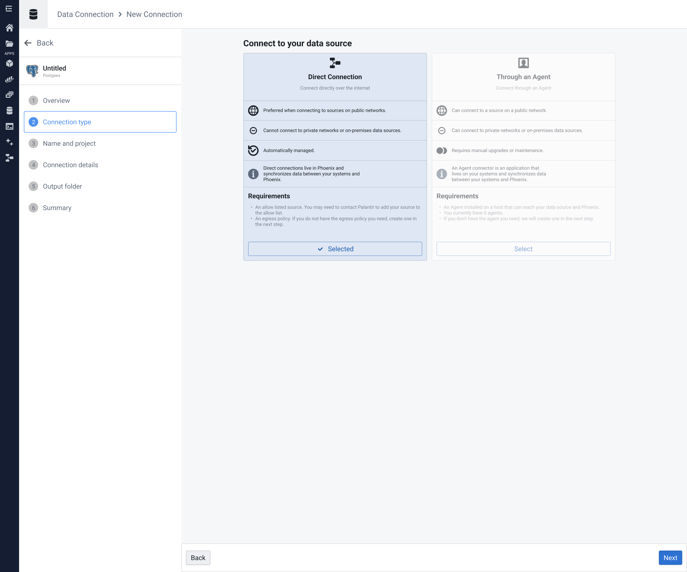
*Stage 2: Connection method selected (direct connection)* [Figma node ID: 11415:22062]

Click **Continue** to proceed to the next stage.

#### Stage 3: Name and Organize Your Source

In this stage, you'll provide details about your source and where it should be stored:

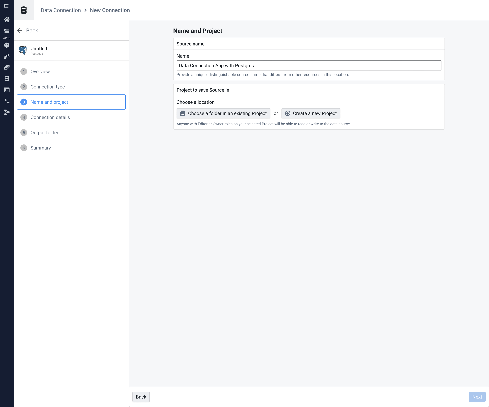
*Stage 3: Naming your source and selecting its location* [Figma node ID: 11415:21939]

You'll need to enter:
1. **Source name**: A clear, descriptive name for this connection
2. **Project**: Where in Phoenix this source will be stored (you can select existing or create new)

**Selecting an Existing Project:**

If you choose to use an existing project, you'll see a dialog to browse and select from available projects:

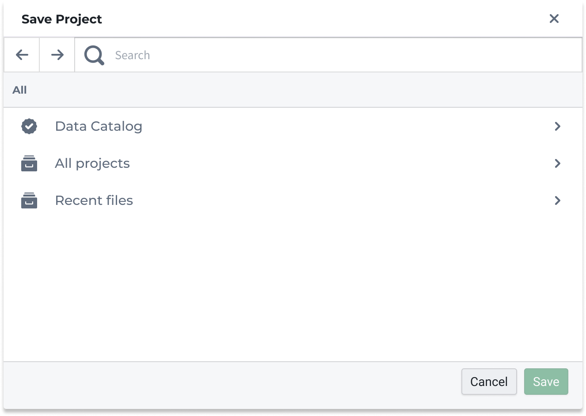
*Stage 3: Browsing existing projects* [Figma node ID: 11415:21608]

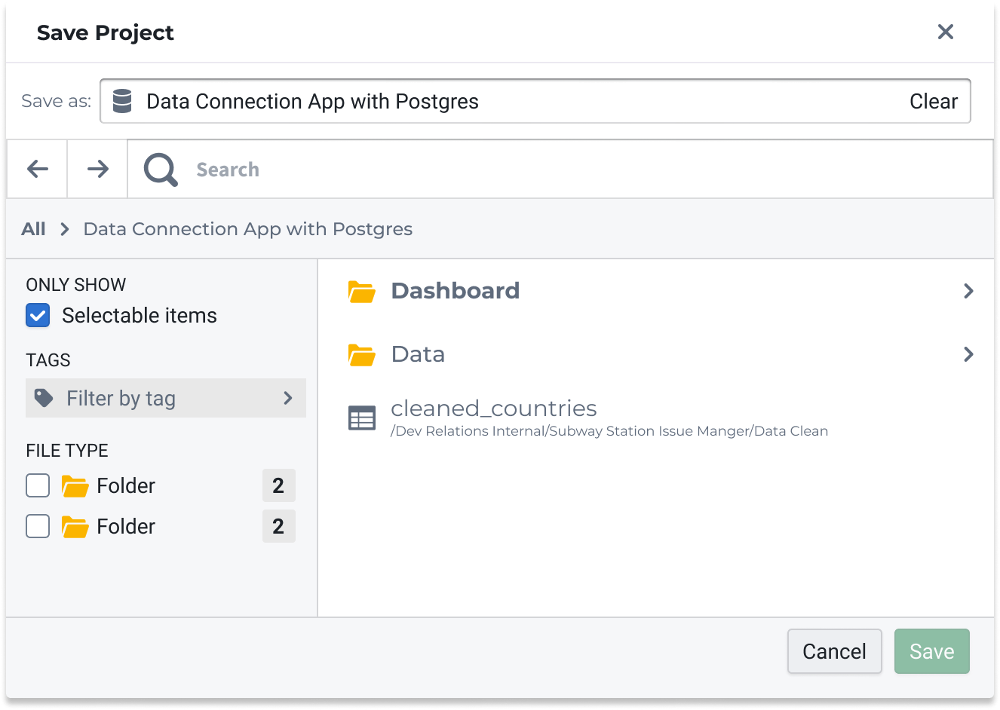
*Stage 3: Selecting a specific project* [Figma node ID: 11415:21635]

**Creating a New Project:**

If you need to create a new project, you'll see a dialog to enter project details:

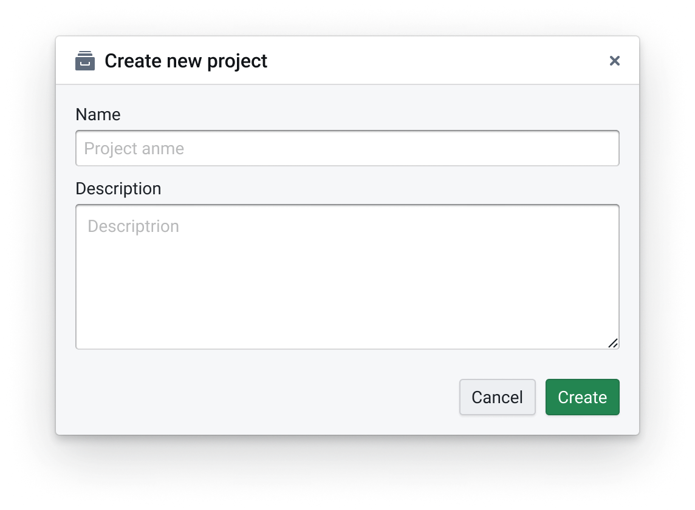
*Stage 3: Creating a new project* [Figma node ID: 11640:156065]

**Note:** Project creation and selection functionality is shared with the Project Explorer application in Phoenix.

Once you've completed this stage, click **Continue** to proceed to the next stage.

#### Stage 4: Configure Connection Details
Now you'll need to provide specific information about your data source:

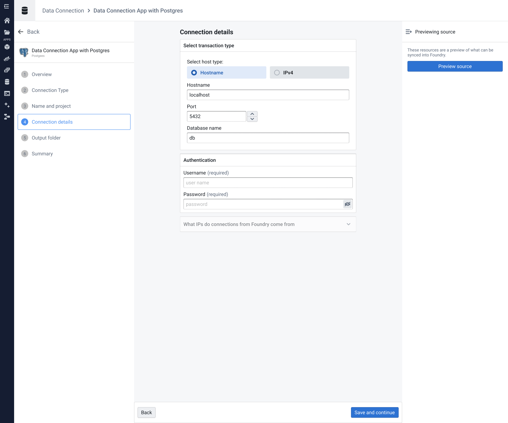
*Stage 4: Initial configuration form with empty fields* [Figma node ID: 11415:21995]

The exact fields vary depending on your source type, but typically include:
- **Connection information**: URLs, hostnames, or endpoints
- **Authentication details**: Usernames, passwords, or access keys
- **Configuration options**: Specific settings for your data source

For PostgreSQL sources, you'll need to provide connection details like host, port, database name, username, and password. For other source types, the form will show different relevant fields.

As you enter your connection details, the system may attempt to connect to your data source to provide a preview of available data:

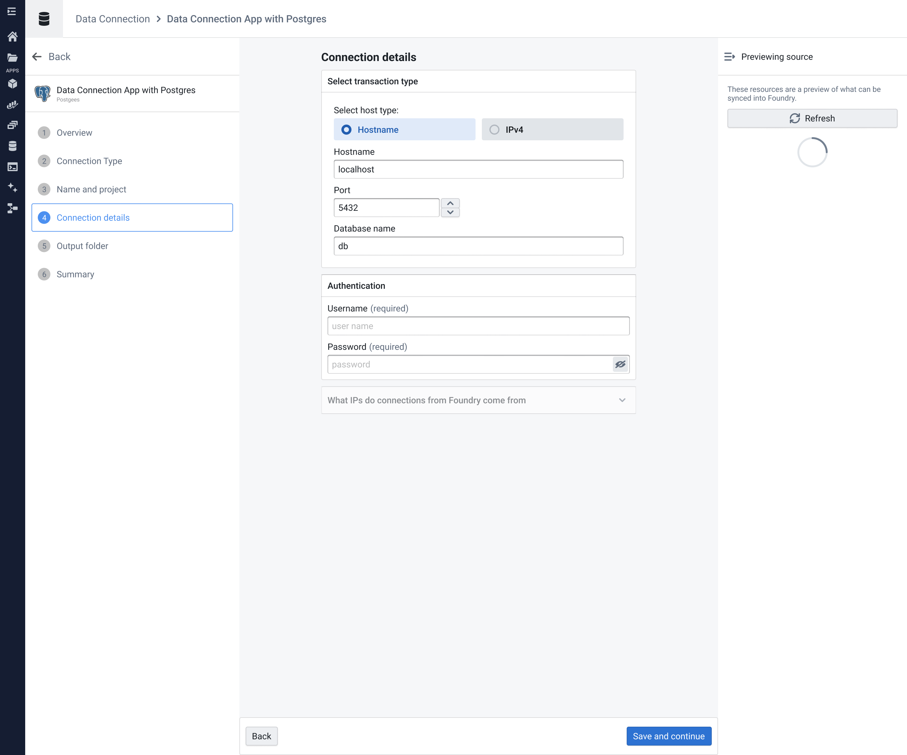
*Stage 4: Loading preview of available data* [Figma node ID: 11640:150976]

Once the connection is established, you may see a preview of your data structure:

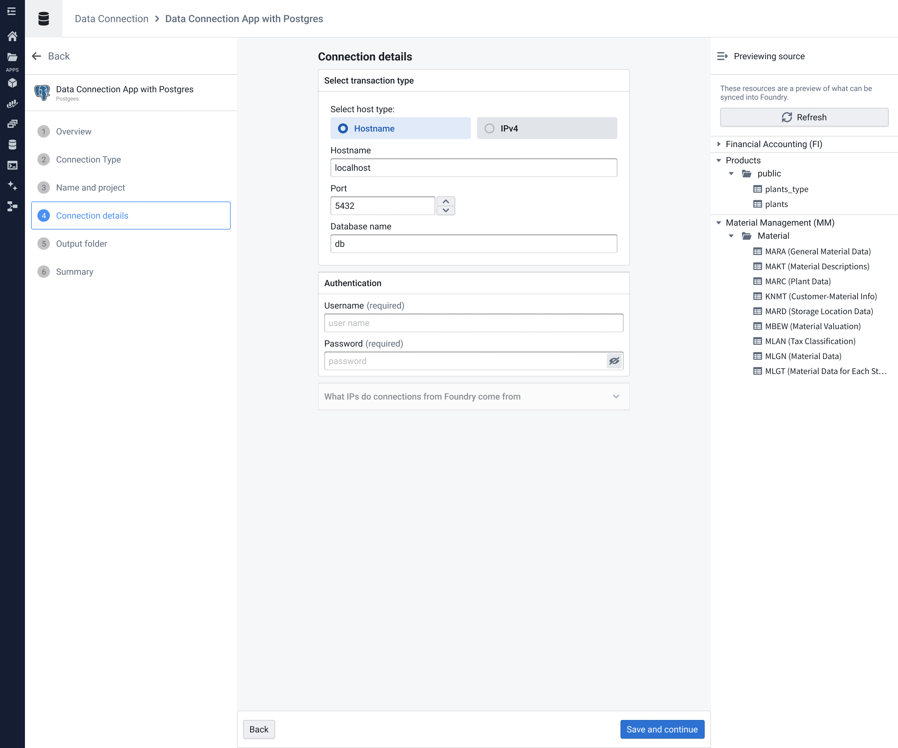
*Stage 4: Preview of available data structure* [Figma node ID: 11640:150641]

This preview helps you verify that:
- The connection is working correctly
- You can see the expected data structure (tables, files, etc.)
- You have the right permissions to access the data

Complete all required fields and click **Continue**.

#### Stage 5: Output Location

In Stage 5, you'll set up the output location for your data within Phoenix:


*Stage 5: Default output folder based on project selection* [Figma node ID: 11415:21731]

This screen allows you to:
1. Review the default output folder that's been generated based on your project selection
2. Click "Select a different folder" link if you want to change the location
3. Click the "Generate" button to create the necessary output structures

When you click "Generate", you'll see a dialog showing the generation process:


*Stage 5: Generating dialog showing items to be created* [Figma node ID: 11415:21335]

The dialog will show each item to be created with status indicators:

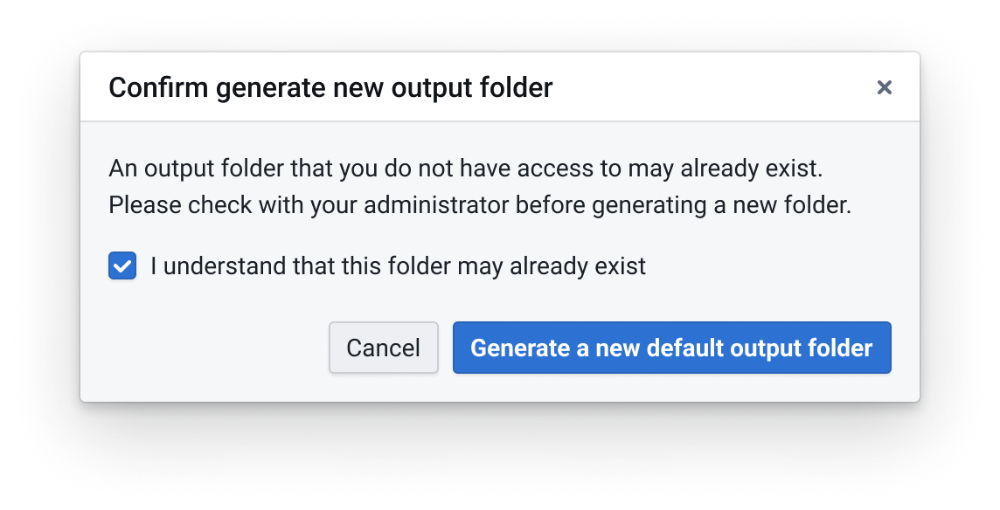
*Stage 5: Items marked for creation* [Figma node ID: 11415:21343]

These status indicators help you understand what's happening during the generation process:

- **Checkmarks (✓)**: Items that already exist in your project structure
- **Addition symbols (+)**: New items that will be created during the process
- **In Progress (spinning icon)**: Items currently being created
- **Error symbols (!)**: Items that could not be created due to permissions or other issues

The dialog gives you visibility into:
1. The folder structure being created
2. Which items are new vs. existing
3. The hierarchy of folders and sub-folders
4. Any potential issues with the creation process

During the generation process, you'll see a loading indicator:

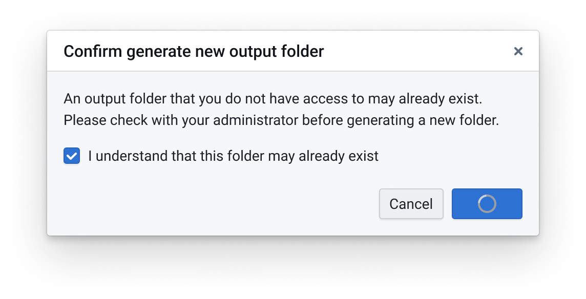
*Stage 5: Loading indicator during generation* [Figma node ID: 11415:21349]

**Selecting a Different Output Folder:**

If you choose to select a different output folder, a dialog will open allowing you to browse the project structure:

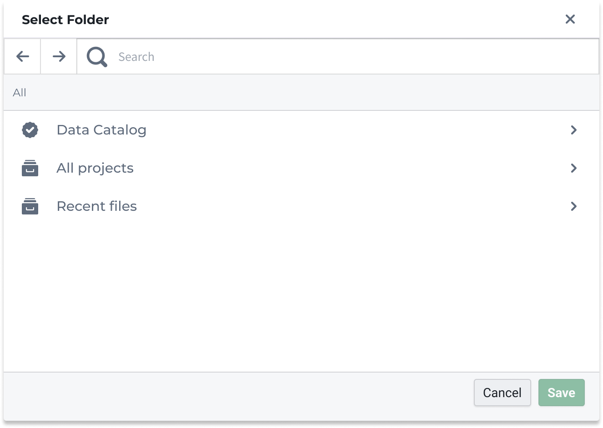
*Stage 5: Dialog for selecting a different output folder - Part 1* [Figma node ID: 11415:21213]

You can navigate through folders to find the desired location:

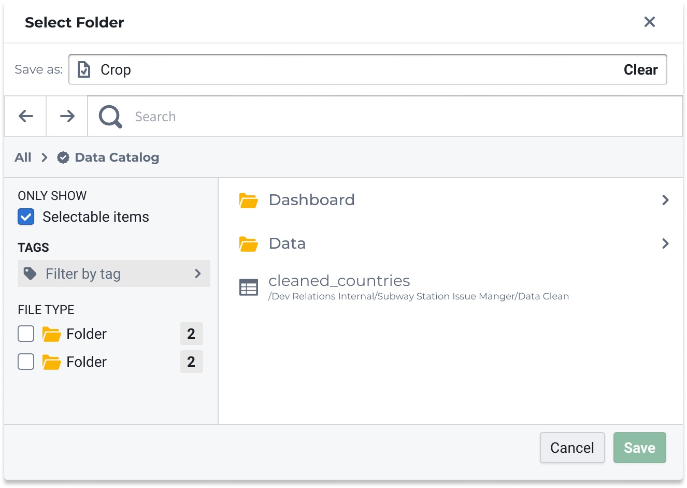
*Stage 5: Dialog for selecting a different output folder - Part 2* [Figma node ID: 11415:21240]

After generation is complete or you've selected a folder, you'll see the final output location:

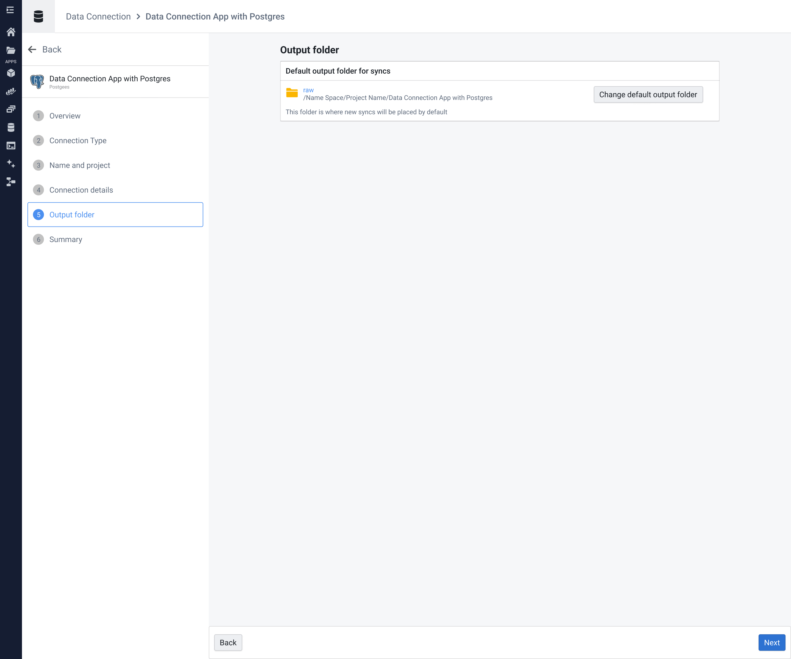
*Stage 5: Successfully generated or selected output location* [Figma node ID: 11415:21780]

Click **Continue** when you're satisfied with the output location.

Once you've verified all settings, click **Continue**.

#### Stage 6: Review Summary and Complete

The final stage provides a comprehensive summary of your connection configuration:

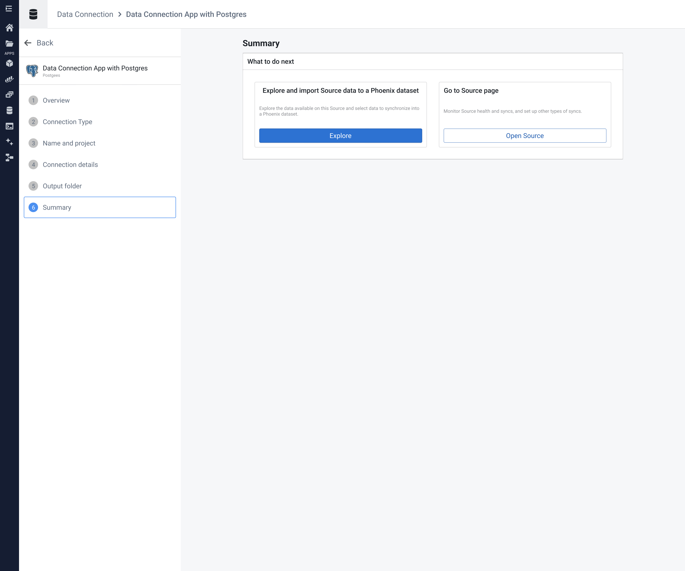
*Stage 6: Connection summary and completion* [Figma node ID: 11415:21829]

To complete your connection setup, you have two options:
1. **Back button**: Return to previous stages if you need to make any changes
2. **Finish button**: Complete the setup and create your source connection

Once your source is created, you'll see two buttons in the "What to do next" section:

1. **Explore button** [Figma node ID: I11415:21872]: This blue primary button redirects you to the "Explore Source" page where you can browse your data, preview its contents, and create syncs.

2. **Open Source button**: This outlined button takes you to the source details page where you can manage connection settings and monitor your source's health.

## Part 5: Exploring Your Source

After creating your data source connection, the next step is to explore the data that's available in that source. The Explore interface helps you browse, preview, and select specific data for syncing into Phoenix.

### The Explore Interface: Initial View [Figma node ID: 11415:21355]

When you first enter the Explore interface, you'll see a screen with three main sections:

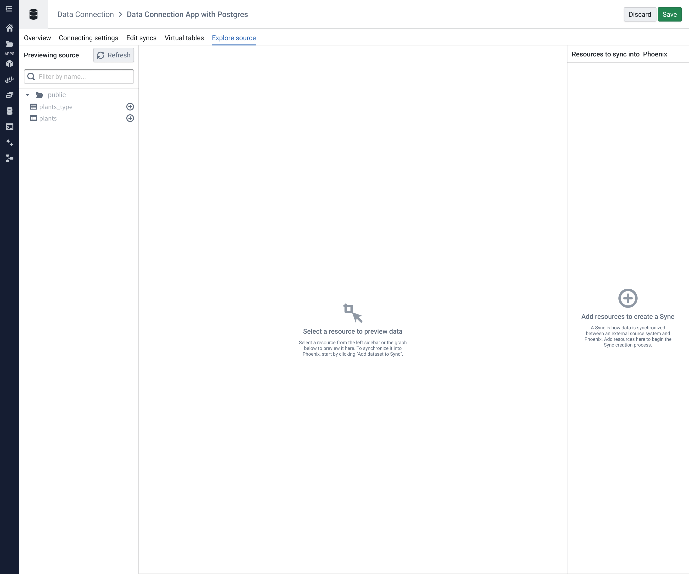
*The initial Explore interface showing the resource browser, main content area, and empty right panel* [Figma node ID: 11415:21355]

#### 1. Left Sidebar: Resource Browser

The left sidebar contains:
- A **breadcrumb navigation** showing your current location
- A **search box** to find specific resources
- A **hierarchical tree** showing available resources in your source
  - For database sources: Schemas, tables, and views
  - For file sources: Folders and files
  - Icons indicating the type of each resource

This sidebar allows you to navigate the structure of your data source and select specific resources to explore.

#### 2. Main Content Area (Empty State)

When you first enter the Explore interface or haven't selected any resource, the main content area shows an empty state with:
- A **welcome message** explaining what you can do in this interface
- **Instructions** to select a resource from the left sidebar
- A **placeholder image** indicating no resource is currently selected

#### 3. Right Sidebar (Initially Hidden)

The right sidebar is not visible in the initial state. It will appear when you select a resource and provide options for managing and previewing data.

### Selecting a Resource: Loading State [Figma node ID: 11442:15627]

When you click on a resource in the left sidebar, the interface enters a loading state:

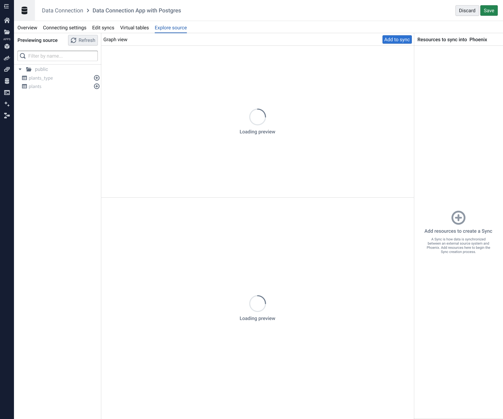
*The Explore interface in loading state while fetching resource details* [Figma node ID: 11442:15627]

During the loading state:
- The selected resource is highlighted in the left sidebar
- The main content area displays a loading animation
- A message indicates that Phoenix is retrieving information about the selected resource
- The loading state gives visual feedback that the system is working on your request

This loading state typically appears briefly while Phoenix establishes a connection to your data source and fetches metadata about the selected resource.

### Viewing Resource Details: Loaded State [Figma node ID: 11415:21415]

After the resource details are loaded, you'll see a detailed view:

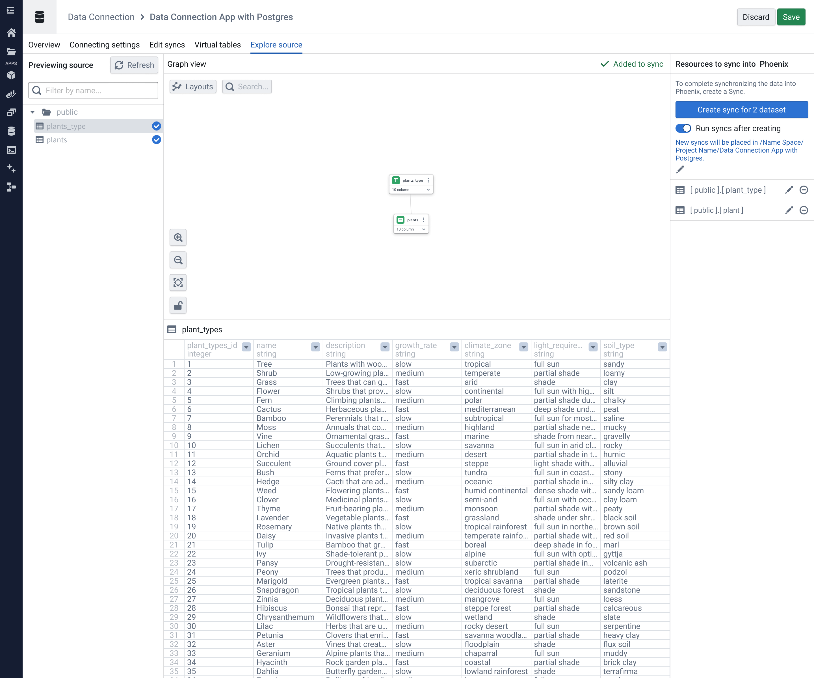
*The Explore interface showing details of the selected resource* [Figma node ID: 11415:21415]

The interface now shows:

#### 1. Left Sidebar (Resource Browser)
- The selected resource remains highlighted
- You can click other resources to explore them

#### 2. Main Content Area (Resource Details)
- A **header** showing the resource name and type
- **Metadata** about the resource:
  - For tables: Number of rows, columns, and data size
  - For files: File size, format, and last modified date
- A **data preview** showing sample content:
  - For tables: Grid view of rows and columns with data types
  - For files: Preview of file content when possible

#### 3. Right Sidebar (Actions Panel) [Figma node ID: 11415:21528]

The right sidebar now appears, showing:
- **Create Sync** button to start creating a sync for the selected resource
- **Resource information** panel with additional details
- **Options** for how to handle the data
- For tables, a **Table Preview** section showing a visual representation of the data [Figma node ID: 11415:21474]

### Preview source

When you select a database table, you'll get additional details:

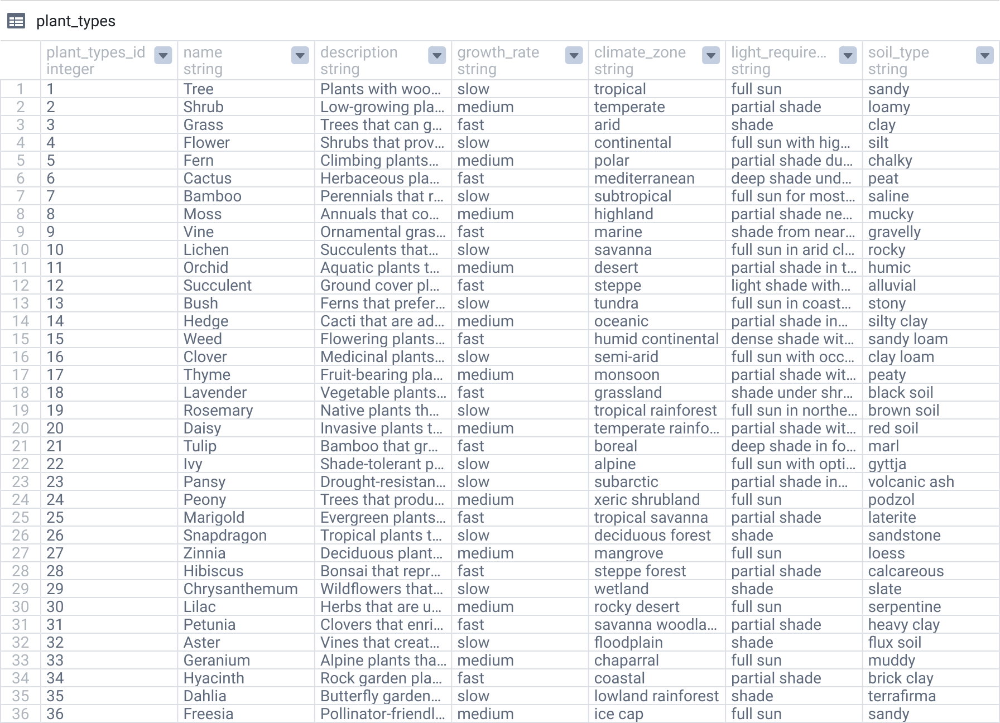
*Detailed view of a selected database table* [Figma node ID: 11415:21474]

The table view provides:

1. **Column information**:
   - Column names
   - Data types
   - Primary key indicators
   - Sample values

2. **Preview data**:
   - A sample of actual rows from the table
   - Pagination controls to browse through the sample data
   - Column sorting options

#### Table Details Panel [Figma node ID: 11415:22943]

To access detailed configuration for tables, look for the table settings icon in the interface:


*The table settings icon that opens the Table Details panel* [Figma node ID: 11415:21544]

Clicking this icon opens the Table Details panel with two tabs for configuring different aspects of your table data:

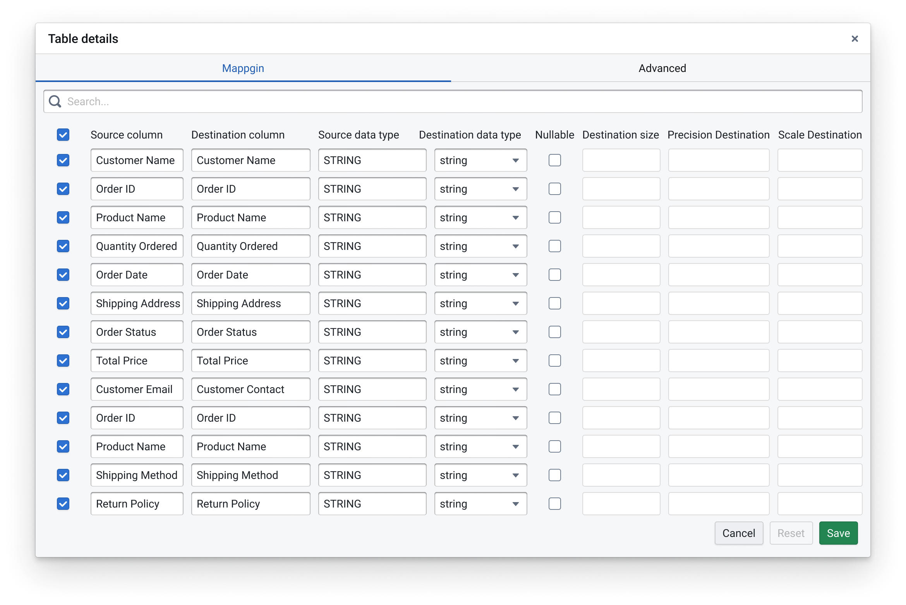
*Table Details panel with Mapping tab selected* [Figma node ID: 11415:22943]

##### Mapping Tab

The Mapping tab is the default view and provides detailed column configuration options:

- **Column selection checkboxes**: Allow you to choose which columns to include in your sync
- **Column configuration table** with the following properties for each column:
  - **Source Column**: The original column name in the data source
  - **Destination Column**: The column name to use in Phoenix (editable)
  - **Source Data Type**: The data type in the original source
  - **Destination Data Type**: The data type to use in Phoenix (selectable via dropdown)
  - **Nullable**: Whether the column can contain null values (toggleable)
  - Additional properties specific to the column type

After making changes in the Mapping tab, you have options to:
- **Save**: Apply the changes to your configuration
- **Reset**: Revert to the original column mappings
- **Cancel**: Discard all changes

##### Advanced Tab

The Advanced tab provides format-specific configuration options, particularly useful for CSV and other structured file formats:

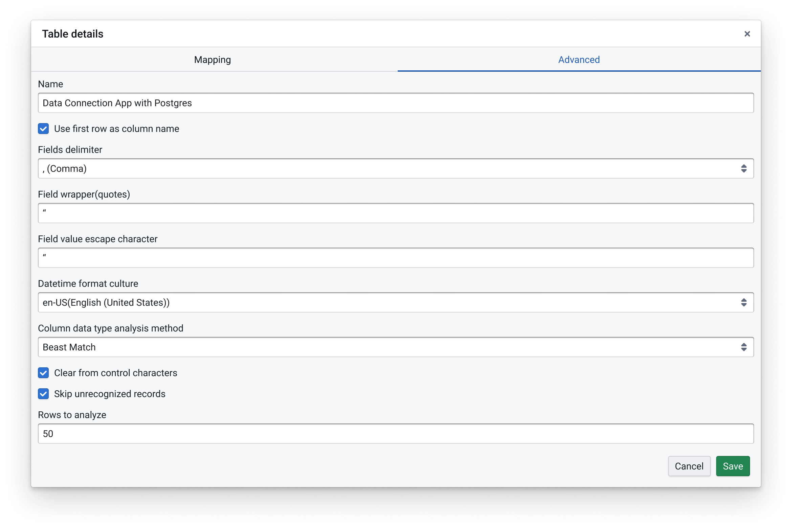
*Advanced configuration options for table data* [Figma node ID: 11441:13761]

The Advanced tab includes:

- **Table Name**: Option to rename the table
- **Use first row as column names**: Toggle whether the first row contains headers
- **Fields delimiter**: Dropdown to select the character that separates values (comma, tab, semicolon, etc.)
- **Field wrapper (quotes)**: Specify the character used to wrap text fields
- **Field value escape character**: Character used to escape special characters in the data
- **Column data type analysis method**: Dropdown to select how data types are determined
- **Additional format-specific settings** that vary based on the data source type

#### Working with Dropdown Selectors

##### Example 1: Fields Delimiter Dropdown

In the Advanced tab of the Table Details panel, the **Fields delimiter** dropdown allows you to select the character that separates values in your CSV or text files:

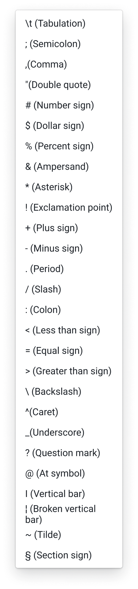
*Fields delimiter dropdown selector* [Figma node ID: 11552:12273]

The Fields delimiter dropdown includes these common options:
- **Comma (,)**: The default delimiter for most CSV files
- **Tab (\t)**: Used in tab-separated value files (TSV)
- **Semicolon (;)**: Common in European CSV files where comma is used as decimal separator
- **Pipe (|)**: Used in specialized data formats
- **Space ( )**: For space-delimited text files
- **Custom**: Allows you to specify any other delimiter character

Selecting the right delimiter is crucial for Phoenix to correctly parse your structured text files.

##### Example 2: Column Data Type Analysis Method

When clicked, dropdowns expand to show available options:

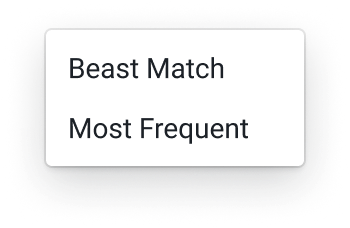
*Expanded view of Column data type analysis method dropdown* [Figma node ID: 11640:156358]

The Column data type analysis method dropdown provides options for how Phoenix should interpret data types:

- **Smart detection**: Analyzes sample data to automatically determine appropriate data types
- **Use header row types**: Takes type hints from header row if available
- **String only**: Treats all data as string/text values regardless of content
- **Strict typing**: Enforces strict data type validation and rejects non-conforming values
- **Custom mapping**: Allows you to manually specify types for each column

This setting determines how Phoenix interprets your data during preview and sync operations.

Using these dropdown selectors, you can configure exactly how your table data should be handled during preview and when creating syncs.

### Creating a Sync from the Explore Interface

Once you've found data you want to bring into Phoenix, you can create a sync directly from the Explore interface:

1. Select the resource (table, file, etc.) you want to sync
2. Click the **Create Sync** button in the right sidebar
3. This will start the sync creation process described in Part 6

This direct path from exploration to sync creation makes it easy to immediately act on data you've discovered in your source.

## Part 6: Creating and Managing Syncs

### What is a Sync?

After connecting to a data source, you need to set up a **sync** to specify exactly what data you want to bring into Phoenix and how often.

Think of it like this:
- Your **source** connection is like having a key to a library
- A **sync** is picking specific books to bring into Phoenix and deciding how often to check for new editions

Each source can have multiple syncs to bring different datasets into Phoenix. For example, from a single PostgreSQL source, you might create separate syncs for customer data, product data, and transaction data.

### Types of Syncs 

Phoenix Data Connection offers several types of syncs to match different data needs:

1. **Batch sync**: The most common type - pulls data on a schedule
   - **Table batch sync**: Pulls data from database tables (PostgreSQL, Snowflake, etc.)
   - **File batch sync**: Pulls files from storage systems (S3, Google Cloud Storage, etc.)

2. **Streaming sync**: For continuous, real-time data flows (for systems that support streaming)

3. **Change Data Capture (CDC)**: Only pulls data that has changed since the last sync (more efficient for large datasets)

4. **Media sync**: For specialized media content like images, videos, or audio files

The sync type you choose depends on your data source and your specific needs for data freshness and volume.

### Creating Your First Sync: Step-by-Step 

Now that you've created a source connection, there are two main paths to set up a sync to bring data into Phoenix:

#### From the Explore Source Page [Figma node ID: 11415:21415]

After exploring your source and finding data you want to sync:

1. Select one or more resources in the Explore interface
2. Click the **Create Sync for [X] Dataset** button in the right sidebar
3. This takes you directly to the sync creation interface with your selected resources


*Creating a sync directly from the Explore Source page* [Figma node ID: 11415:21415]

#### Multiple Resources Selected [Figma node ID: 11415:22451]

When you've selected multiple tables or files to sync from the Explore Source page, you'll see an interface like this:

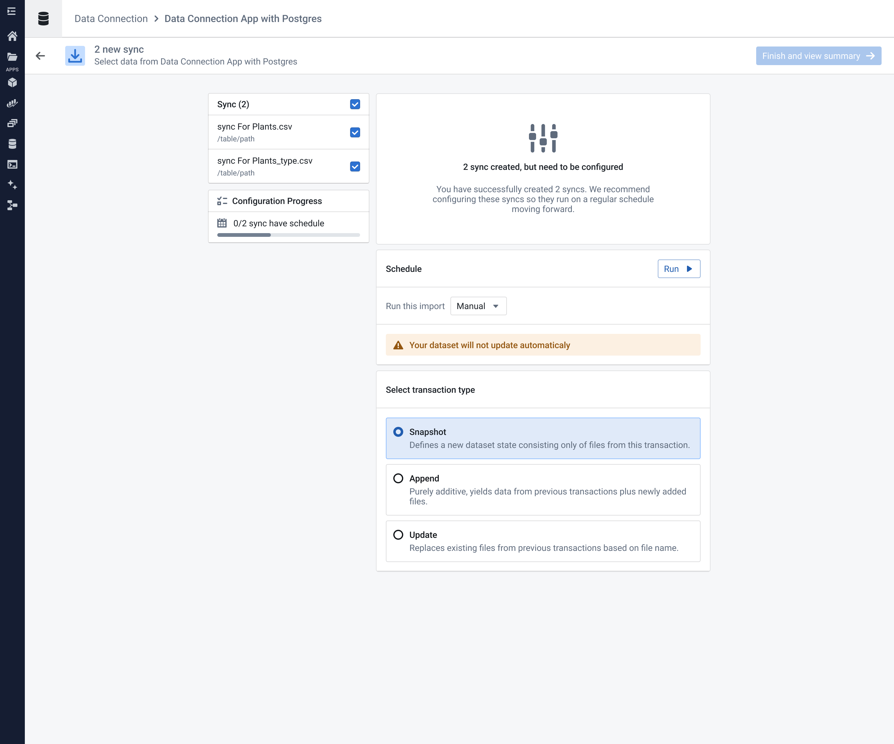
*Sync creation interface for multiple resources* [Figma node ID: 11415:22451]

This view includes:

1. **Header**: Shows "X New Sync" where X is the number of resources you're syncing
2. **Left sidebar**: Lists the resources to be synced, with checkboxes to include/exclude them
3. **Main section**: Contains configuration options that apply to all selected resources:
     - **Schedule settings**: Define how often the sync should run
     
     You can select from options in the dropdown menu:
     
     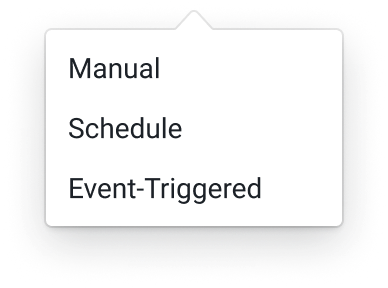
     *Schedule dropdown selection list* [Figma node ID: 11415:22942]

     Depending on your selection, you will see one of the following:
     
     **If you select "Manual":**
     
     
     *Alert shown when selecting manual scheduling* [Figma node ID: 11415:22520]
     
     **If you select "Schedule" (hourly, daily, etc.):**
     
     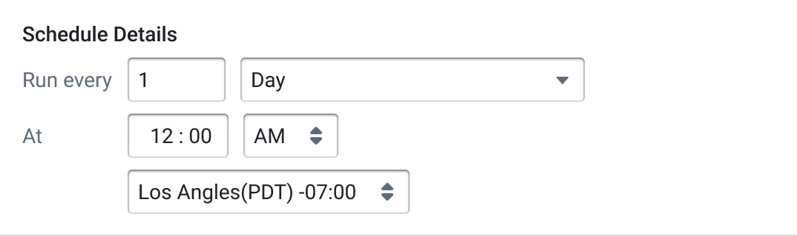
     *Schedule details configuration interface* [Figma node ID: 11415:22614]
     
     The schedule configuration allows you to precisely define when your syncs will run.
   
   - **Transaction type**: Choose how data updates should be handled
     
     
     *Transaction type selection* [Figma node ID: 11415:22527]
     
     The transaction types determine how Phoenix handles updates to your data:
     
     - **Snapshot**: Each sync completely replaces all previous data with the new data. This ensures your data in Phoenix exactly matches your source data at the time of the sync, but may use more resources for large datasets.
     
     - **Append**: Each sync adds new data without removing existing data. This is efficient for adding new records but doesn't update or remove old records that have changed in the source.
     
     - **Update**: Combines features of both - adds new records while updating existing records that have changed in the source. Uses primary keys to identify which records to update.

#### Single Resource Selected [Figma node ID: 11415:22676]

When you've selected just one resource to sync, you'll see a more detailed interface:

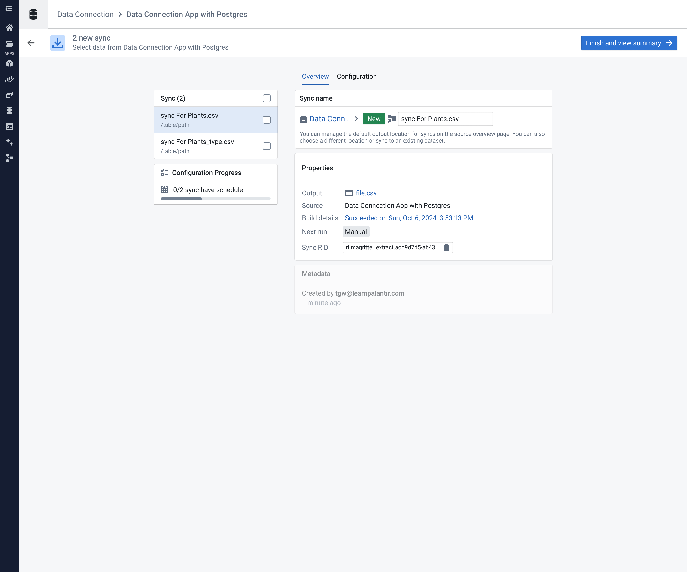
*Sync creation interface for a single resource in Option 1* [Figma node ID: 11415:22676]

This view includes two tabs:

1. **Overview tab** (shown by default):
   - Input field to name your sync
   - Current folder path with an option to change it
   
   
   *Button to change or create a folder* [Figma node ID: 11640:158732]
   
   - Detailed properties about the resource
   
   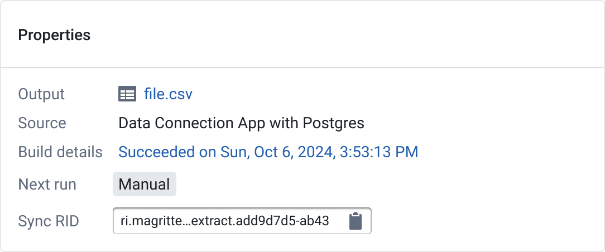
   *Resource properties details* [Figma node ID: 11452:19943]

2. **Configuration tab**: Provides resource-specific configuration options
   
   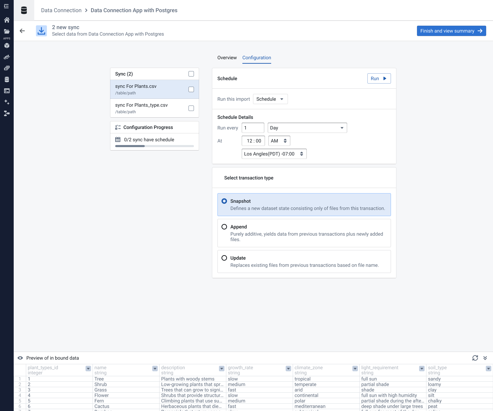
   *Configuration options for a single resource in Option 1* [Figma node ID: 11415:22763]
   
   - Advanced settings for the specific resource type
   - Data transformation options
   - Schema and type mapping
   
3. **Preview section**: Shows a preview of the data to be synced (visible in both tabs)
   
   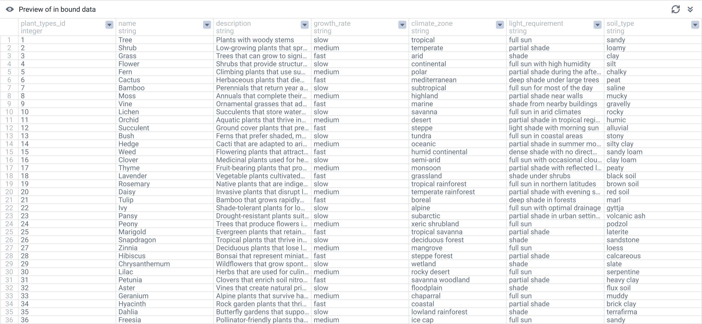
   *Data preview for the selected resource* [Figma node ID: 11640:159760]

After configuring your sync settings, clicking the "Finish and view summary" button [Figma node ID: 11415:22776] will save the sync and display it in the source details page. When you return to the source details page, you'll see your newly created sync listed, and you can create additional syncs by clicking the "Create Batch Sync" button.

### Managing Existing Syncs

After you've created one or more syncs, you'll need to manage them over time. Phoenix provides a dedicated interface for managing your existing syncs with similar functionality to the creation process, but with some key differences in the navigation and layout.

#### Accessing the Sync Management Interface

To manage existing syncs:

1. Navigate to the source details page
2. Switch to the **Edit Syncs** tab in the horizontal navigation menu
3. This tab displays all existing syncs for the current source

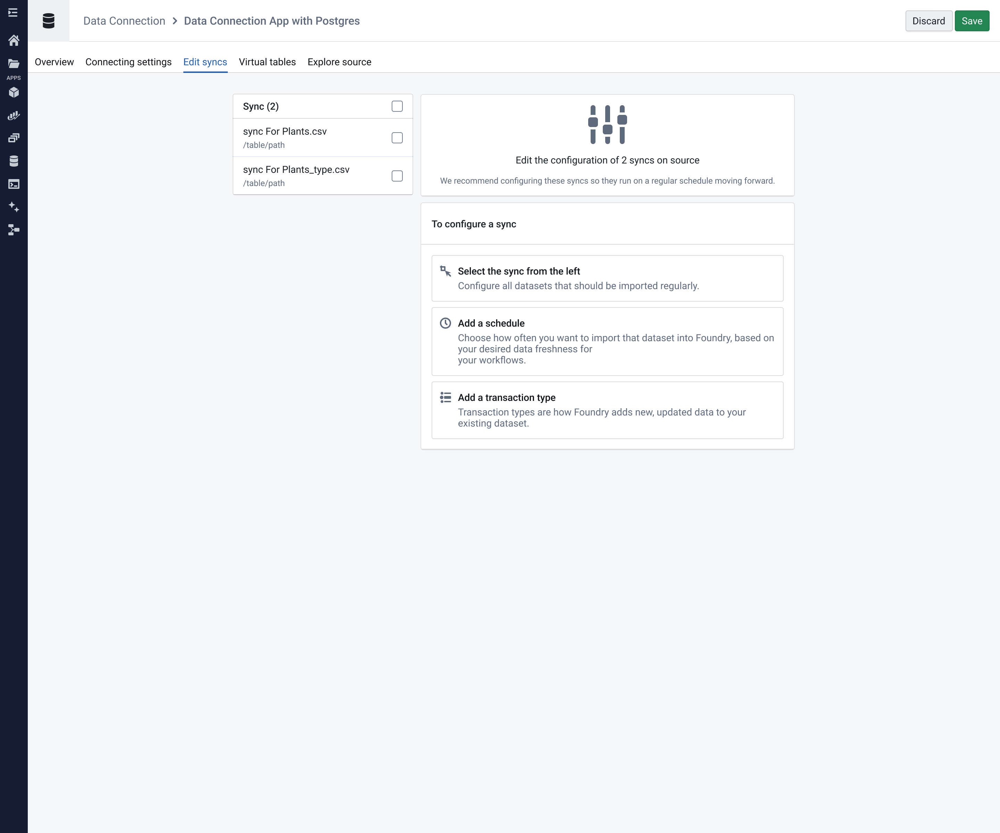
*Edit Syncs tab in the Source Details page showing available resources and existing syncs* [Figma node ID: 11640:161064]

The Edit Syncs tab provides:

- A list of all resources available from your source in the left panel
- Existing syncs shown in the center panel with status indicators

> **Note:** The core functionality for managing existing syncs is the same as the creation process. The main differences are in the interface layout, navigation options, and the fact that you're editing pre-populated settings rather than configuring from scratch.

#### Editing a Single Sync

When you select an existing sync for editing, you'll enter an interface similar to the sync creation process, but with the current sync's settings pre-populated:

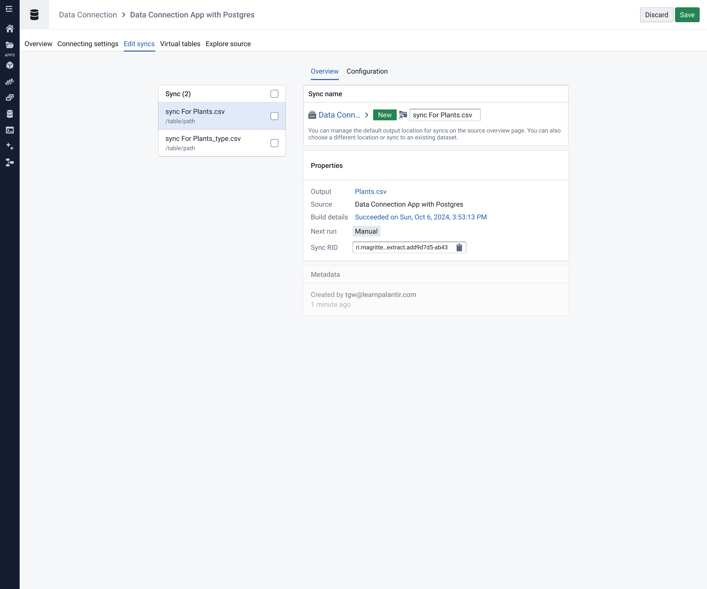
*Editing a single sync - Overview tab with existing configuration* [Figma node ID: 11640:161505]

The single sync editing interface includes two tabs:

1. **Overview tab** (shown above):
   - The sync's current name (which you can edit)
   - Current output folder path with option to change
   - Resource properties and metadata

2. **Configuration tab**:

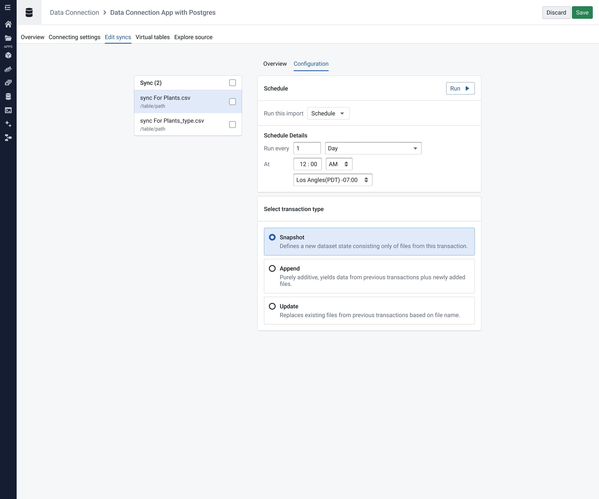
*Editing a single sync - Configuration tab with advanced options* [Figma node ID: 11640:161430]

The Configuration tab provides:
   - Scheduling options (manual or scheduled)
   - Transaction type settings (Snapshot, Append, or Update)

Key differences in the editing interface compared to creation:
- Navigation breadcrumbs show your path within the Edit Syncs section
- Action buttons in the top-right corner for managing your changes:

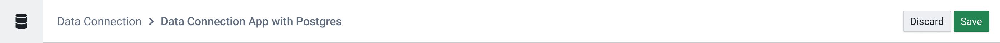
*Discard and Save buttons for managing sync changes* [Figma node ID: 11640:161601]

The action buttons provide clear options:
- **Discard**: Abandons all your changes and returns to the Edit Syncs tab without saving
- **Save**: Applies all your changes and updates the sync configuration

These buttons help ensure you don't accidentally modify syncs, as you must explicitly choose to save your changes when you're done editing.

#### Managing Multiple Syncs

Phoenix also provides tools for managing multiple syncs simultaneously:

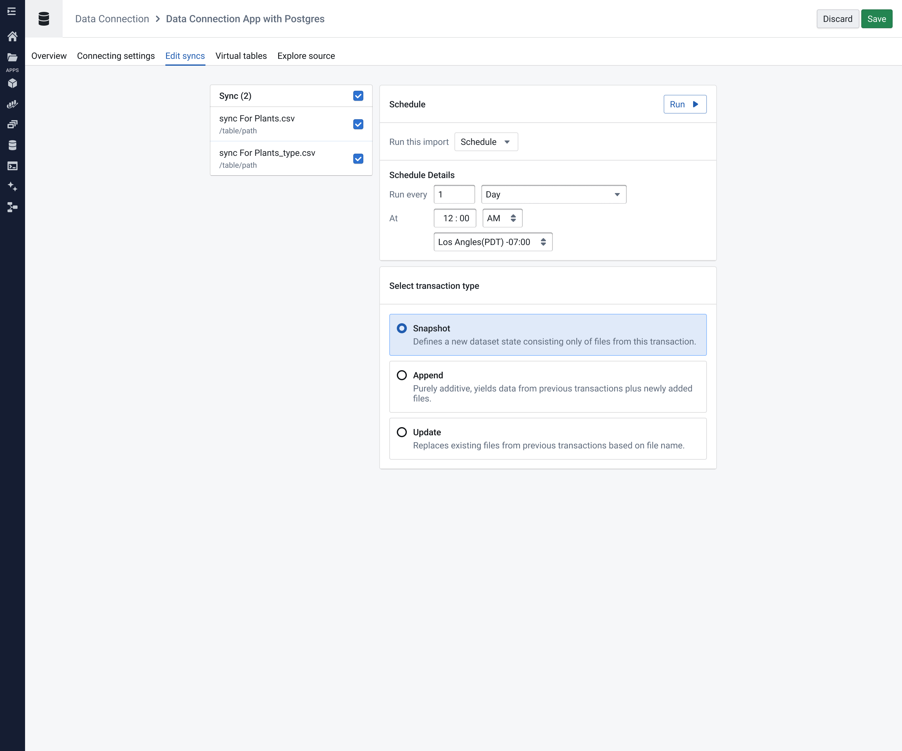
*Interface for managing multiple syncs together* [Figma node ID: 11532:11553]

From this view, you can:
1. Select multiple syncs using checkboxes
2. Perform batch operations on selected syncs:
   - Run multiple syncs at once
   - Delete several syncs together
   - Modify shared settings across multiple syncs
3. Monitor the status of all syncs
4. View historical run information and next scheduled run times

#### Sync Management Workflow

The overall sync management workflow works like this:

1. Navigate to source details → Switch to Edit Syncs tab → View all existing syncs
2. To edit a single sync: Select sync → Modify settings in Overview or Configuration tab → Save changes
3. To manage multiple syncs: Select checkboxes next to syncs → Use action buttons for batch operations

After making changes to your syncs, you can always return to the Overview tab to see a summary of all configured syncs with their status and scheduling information:

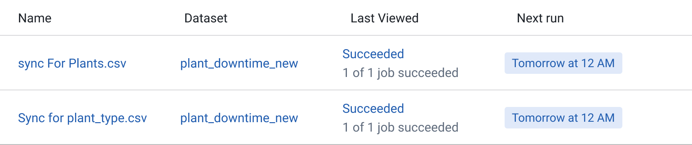
*Overview tab showing configured syncs with status and next run information* [Figma node ID: 11442:16268]


## Part 7: Managing Connection Settings

After creating a data source, you may need to view or modify its connection settings. The Connection Settings tab provides a comprehensive way to manage all aspects of your data source connection.

### Accessing Connection Settings [Figma node ID: 11442:16592]

To access the Connection Settings for an existing source:

1. Navigate to the **Source** tab in Data Connection
2. Click on the source you want to manage
3. In the source details page, click on the **Connection Settings** tab in the horizontal tab bar at the top

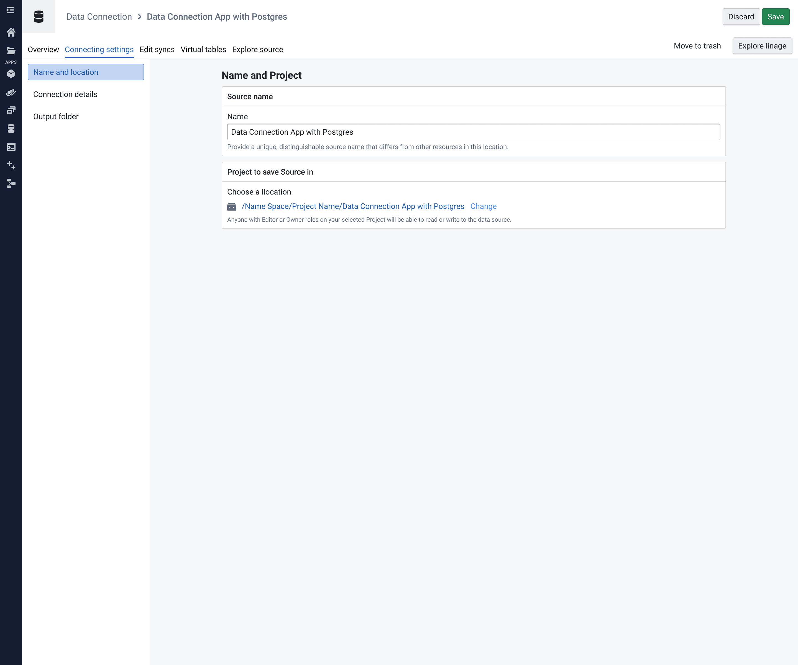
*The Connection Settings tab in the source details page* [Figma node ID: 11442:16592]

The Connection Settings tab is selected when it shows with a blue highlight and a blue underline. When you click this tab, the interface will switch to show you all the connection configuration options for your data source.

### Connection Settings Interface Layout [Figma node ID: 11442:16915]

The Connection Settings interface has a clear, organized layout with three main areas:

1. **Left Navigation Bar**: A vertical sidebar that shows the different sections of your connection settings
2. **Main Content Area**: The large central area that displays the settings for whichever section you've selected
3. **Action Buttons**: At the top-right of the screen, "Discard" and "Save" buttons let you either cancel your changes or apply them


*The overall layout of the Connection Settings interface* [Figma node ID: 11442:16915]

This consistent layout makes it easy to navigate between different aspects of your connection while always having access to the save and discard options.

### Left Navigation Menu [Figma node ID: 11442:16905]

The left navigation menu organizes connection settings into logical sections that mirror the setup process you went through when first creating the source:

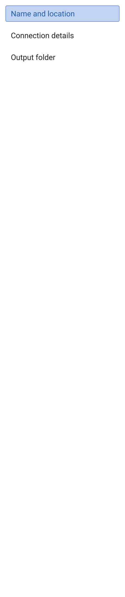
*The left navigation menu in Connection Settings* [Figma node ID: 11442:16905]

It includes these clearly labeled sections:

1. **Name and location**: Edit basic information about your source, including its name and project location
2. **Connection details**: Modify technical connection parameters specific to your source type
3. **Output folder**: Change where data from this source will be stored within Phoenix

The currently selected section is highlighted with a blue background and blue text, while other sections appear as regular text items. Clicking any section immediately loads its settings in the main content area.

### Name and Location Section [Figma node ID: 11445:17221]

When you select "Name and location" in the left navigation bar, you'll see two main panels in the content area:

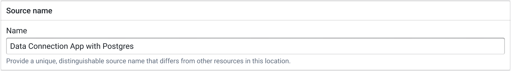
*The Name and Project section in Connection Settings* [Figma node ID: 11445:17221]

#### Source Name Panel

The top panel lets you manage the basic identity of your source:

- **Source name**: An editable text field showing the current name of your source connection
- **Helper text**: Below the input field, there's a note explaining "Provide a unique, distinguishable source name that differs from other resources in this location"

The source name is important as it helps you identify this specific connection among all your data sources in Phoenix. Choose a descriptive, clear name that indicates both the type of source and its purpose.

#### Project Location Panel [Figma node ID: 11445:17263]

The lower panel shows where your source is stored within Phoenix's project structure:

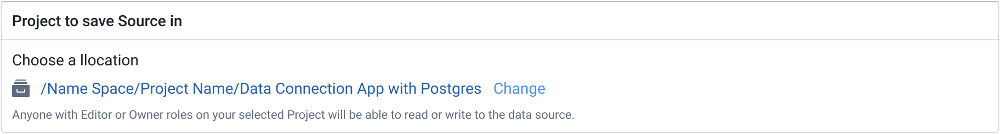
*The Project Location Panel showing where your source is stored* [Figma node ID: 11445:17263]

- **Project to save Source in**: A header indicating this section's purpose
- **Current location path**: Shows the complete path to where your source is currently stored, in the format "/Name Space/Project Name/Your Source Name"
- **Change button**: A blue "Change" link that lets you select a different project location

When you click "Change," you'll see a project browser dialog that lets you navigate through your available projects and select a new location for the source.

> **Note**: Moving a source to a different project will affect who has access to it. Only users with appropriate permissions in the new project location will be able to see and use the source.

### Connection Details Section [Figma node ID: 11445:17304]

The Connection Details section contains the technical configuration specific to your source type. When selected from the left navigation, it shows fields relevant to your particular connection:

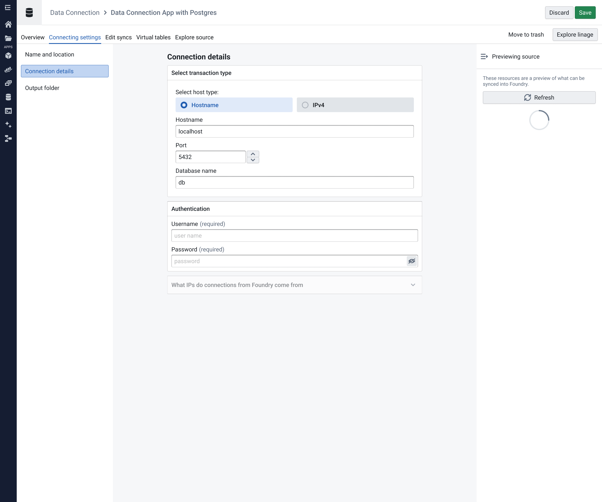
*The Connection Details section in Connection Settings* [Figma node ID: 11445:17304]

#### What You'll See Here

The exact fields vary based on your source type, but typically include:

For **Database Sources** (like PostgreSQL, MySQL):
- Host name or server address
- Port number
- Database name
- Authentication credentials (username/password or other auth methods)
- SSL configuration options
- Connection timeout settings

For **Cloud Storage Sources** (like Amazon S3):
- Bucket name or container ID
- Region selection
- Access key and secret key fields
- Authentication method options
- Path prefix settings

For **File System Sources**:
- Root path configuration
- Authentication details
- Folder filter options

### Output Folder Section [Figma node ID: 11640:162363]

The Output Folder section lets you control where data from your source will be stored within Phoenix:

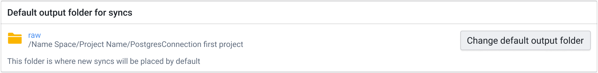
*The Output Folder section in Connection Settings* [Figma node ID: 11640:162363]

#### Key Elements

This section includes:

- **Section header**: Clearly labeled "Output folder" at the top of the content area
- **Default output folder panel**: A structured panel showing information about your default output location
  - Panel header: "Default output folder for syncs"
  - Folder icon: Visual indicator of the folder type (shown in yellow)
  - Current path: Displays the complete path in the format "/Name Space/Project Name/YourConnectionName"
  - Change button: A button labeled "Change default output folder" that lets you select a different location
- **Explanatory text**: Below the folder path, the interface explains "This folder is where new syncs will be placed by default"

The output folder determines where users will find data from this source when they browse Phoenix. Choose locations that make logical sense within your organization's data structure.

#### Changing the Default Output Folder

When you click the "Change default output folder" button, a folder browser dialog will open allowing you to:

1. Navigate through your existing folder structure
2. Select a different location for your synced data
3. Create a new folder if needed

After selecting a new location and confirming your choice, the interface will update to show the new path.

#### Important Considerations

When changing the output folder:

- Existing syncs may need to be updated separately
- Data that has already been synced to the previous location won't automatically move
- Permissions on the new folder will determine who can access the synced data

> **Warning**: Changing the output folder for a source that already has active syncs may cause those syncs to fail unless they're updated accordingly. Always check your syncs after changing the output location.

### Working with Connection Settings

#### Making Changes

To modify any connection setting:

1. Select the appropriate section from the left navigation
2. Make your changes in the main content area
3. For sensitive changes like connection details
4. Click "Save" in the top-right corner to apply your changes

If you decide not to keep your changes, click "Discard" instead of "Save" to revert to the previous settings.

#### Save and Discard Buttons

The action buttons at the top of the screen provide clear options:

- **Save**: A green button that applies all your changes across all sections
- **Discard**: A neutral button that abandons your changes and returns settings to their previous state

#### Confirmation Dialog

When making significant changes, you may see a confirmation dialog asking you to verify the changes. This is especially common when:

- Changing project location
- Modifying connection credentials
- Updating output folders for sources with existing syncs

These confirmations help prevent accidental changes that could disrupt your data flows.

### When to Update Connection Settings

There are several common scenarios when you might need to update connection settings:

1. **Credentials changed**: When database passwords or API keys are rotated in the source system
2. **Server migration**: When your source data moves to a new server or location
3. **Project reorganization**: When restructuring your Phoenix projects
4. **Configuration optimization**: When fine-tuning connection parameters for better performance

Regular maintenance of your connection settings ensures your data sources remain accessible and secure as your infrastructure evolves.

## Part 8: Glossary of Terms

Here's a comprehensive explanation of common terms you'll encounter in Data Connection:

### A-C
- **Agent**: A small program installed in your network that helps Phoenix connect to your data, especially useful for accessing data behind firewalls or in private networks
- **Agent-based Connection**: A connection method that uses an agent to access data sources in private networks or behind firewalls
- **API Source**: A connection to an external system's Application Programming Interface that allows data retrieval
- **Append**: A transaction type where each sync adds new data without removing existing data
- **Application**: A logical container that organizes related data sources and connections
- **Batch Sync**: A process that moves data from source to Phoenix on a schedule
- **Breadcrumb Navigation**: UI element showing your current location in the hierarchical structure
- **CDC (Change Data Capture)**: A sync method that only transfers data that has changed since the last sync
- **Column Mapping**: The process of defining how source data columns will translate to Phoenix columns
- **Connection Settings**: Configuration details for how Phoenix connects to external data sources
- **Connection Type**: The protocol or method used to connect to a data source (JDBC, REST, S3, etc.)
- **Create Batch Sync**: Button that initiates the process to set up a new data synchronization

### D-F
- **Data Preview**: A feature that shows sample rows and columns from your source before creating a sync
- **Data Source Summary**: Overview page shown after completing source creation showing key details
- **Data Type Analysis Method**: Settings that determine how Phoenix interprets and converts data types
- **Dataset**: Where your data is stored in Phoenix after being synced
- **Default Output Folder**: The predefined location where synced data will be stored in Phoenix
- **Direct Connection**: When Phoenix connects directly to a data source without an agent
- **Edit Syncs Tab**: Interface for viewing existing syncs and creating new ones within source details
- **Egress Policy**: Rules that control how data can flow out of Phoenix
- **Explore Interface**: The UI that allows you to browse, preview, and select data for syncing
- **Field Wrapper**: Characters (like quotes) used to encapsulate fields in structured text files
- **Fields Delimiter**: The character used to separate values in structured text files (comma, tab, etc.)
- **File Sync**: A sync that transfers files rather than structured data
- **Folder Selection**: Interface for choosing where synced data will be stored in Phoenix

### G-P
- **Incremental Sync**: A sync that only brings in new or changed data
- **Left Navigation Menu**: The sidebar that provides access to different configuration sections
- **Loading State**: Visual feedback shown when Phoenix is connecting to your data source
- **Mapping Tab**: Interface for configuring how source columns map to destination columns
- **Media Sync**: A specialized sync type for handling media content like images, videos, or audio files
- **Multi-Sync Management**: Interface for selecting and managing multiple syncs together
- **Multiple Resources Selection**: Selecting more than one table or file to sync at once
- **Name and Location**: Section for configuring the basic identity of your data source
- **Overview Tab**: A summary view showing source connection details and metrics
- **Output Folder Section**: Configuration area for specifying where synced data will be stored
- **Output Location**: The folder path where synced data is stored within Phoenix
- **Preview**: A feature that shows sample data before creating a full sync
- **Primary Key**: A column or set of columns that uniquely identify each row in a table
- **Project**: An organizational container in Phoenix for related resources

### Q-Z
- **Query**: A request for specific data, often written in SQL
- **Resource**: An individual data entity (table, file, API endpoint) available in a source
- **Resource Browser**: The left sidebar that shows available resources in your data source
- **Resource Properties**: Metadata and details about a specific data resource
- **Schema**: The structure of your data (columns, data types, etc.)
- **Schema Inference**: The automatic detection of data structure and types
- **Schema Mapping**: The process of matching source columns to destination columns
- **Schedule Type**: When sync executes (Manual, Hourly, Daily, Weekly, Monthly)
- **Single Resource Selection**: Selecting just one table or file to sync
- **Smart Detection**: Automatic analysis of data to determine appropriate types
- **Snapshot Sync**: A sync that replaces all previous data with new data
- **Source**: The external system where your data originally lives
- **Source Creation Wizard**: Step-by-step interface for setting up new data connections
- **Source Details Page**: The main interface for managing an existing data source
- **Source Name**: The identifier for your connection in Phoenix
- **Source Type**: The category of data source (Database, API, Cloud Storage, etc.)
- **Streaming Sync**: A continuous data flow from source to Phoenix in real-time
- **Sync Creation Interface**: The UI where you configure how data moves from source to Phoenix
- **Sync Details View**: Interface showing status and information about configured syncs
- **Sync Type**: The method used to transfer data (Batch, Streaming, CDC, etc.)
- **Table Details Panel**: Interface for configuring column mappings and other table settings
- **Table Preview**: A visual representation of tabular data showing columns and sample rows
- **Table Sync**: A sync that transfers structured data from database tables
- **Test Connection**: Feature to verify that connection settings are valid before saving
- **Transaction Type**: How data updates are handled (Snapshot, Append, Update)
- **Update Strategy**: How new data is integrated with existing data during syncs
- **Virtual Table**: A view of your data that doesn't require copying the actual data

## Conclusion

This guide has provided a comprehensive overview of the Data Connection application in Phoenix, designed for non-technical users. By following these instructions, you should be able to connect to PostgreSQL databases and S3 storage, create and manage syncs, and monitor your data flows.

As you continue working with Data Connection, refer back to this guide whenever you need a refresher on specific steps or concepts.
