# Data Connection Creation - Business Workflow Diagram

*Last updated: July 24, 2025*

This document provides a block schema diagram showing the business workflow for Data Connection creation process, mapping out which components are loaded, what actions are taken at each step, and the corresponding route addresses for navigation.

## Business Workflow Overview

The Data Connection creation process follows a structured 6-stage wizard flow with clear component loading and user action patterns.

## Block Schema Diagram

```mermaid
flowchart TD
    Start([User Initiates Connection Creation]) --> Load1
    
    %% Home Page Flow
    Load1[Load: HomePage Component<br/>Route: /source<br/>Action: Display welcome screen] --> Check1{User Action?}
    Check1 -->|New Source Button<br/>Navigate to: /new-connection| Load2
    Check1 -->|Quick Setup Card<br/>Navigate to: /new-connection| Load2
    
    %% Source Type Selection
    Load2[Load: SourceTypeSelector Component<br/>Route: /new-connection<br/>Action: Display source type grid] --> Action1[User selects source type<br/>Component: SourceTypeGrid<br/>Navigate to: /new-connection/:sourceType/1]
    Action1 --> Load3
    
    %% Wizard Initialization
    Load3[Load: WizardContainer Component<br/>Route: /new-connection/:sourceType/:stage<br/>Action: Initialize 6-stage wizard] --> Load4
    
    %% Stage 1: Overview
    Load4[Load: Stage1Overview Component<br/>Route: /new-connection/:sourceType/1<br/>Action: Show wizard introduction] --> Action2[User reviews requirements<br/>Component: RequirementsChecklist]
    Action2 --> Nav1[Component: NavigationButtons<br/>Navigate to: /new-connection/:sourceType/2<br/>Action: Continue to Stage 2]
    Nav1 --> Load5
    
    %% Stage 2: Method Selection
    Load5[Load: Stage2Method Component<br/>Route: /new-connection/:sourceType/2<br/>Action: Display connection options] --> Action3[User selects connection method<br/>Component: DirectConnectionCard]
    Action3 --> Nav2[Component: NavigationButtons<br/>Navigate to: /new-connection/:sourceType/3<br/>Action: Continue to Stage 3]
    Nav2 --> Load6
    
    %% Stage 3: Name & Project
    Load6[Load: Stage3Name Component<br/>Route: /new-connection/:sourceType/3<br/>Action: Setup source identity] --> Action4[User enters source name<br/>Component: SourceNameInput]
    Action4 --> Action5[User selects/creates project<br/>Component: ProjectSelector]
    Action5 --> Check2{Project Action?}
    Check2 -->|Use Existing| Modal1[Load: ProjectDialog<br/>Modal - Same route<br/>Action: Browse project tree]
    Check2 -->|Create New| Modal2[Load: NewProjectDialog<br/>Modal - Same route<br/>Action: Create project form]
    Modal1 --> Action6[User selects project<br/>Component: ProjectTree]
    Modal2 --> Action7[User creates project<br/>Component: ProjectNameInput]
    Action6 --> Nav3
    Action7 --> Nav3[Component: NavigationButtons<br/>Navigate to: /new-connection/:sourceType/4<br/>Action: Continue to Stage 4]
    Nav3 --> Load7
    
    %% Stage 4: Connection Details
    Load7[Load: Stage4Details Component<br/>Route: /new-connection/:sourceType/4<br/>Action: Setup connection parameters] --> Action8[User fills connection form<br/>Component: ConnectionForm]
    Action8 --> Action9[User tests connection<br/>Component: TestConnectionButton]
    Action9 --> Load8[Load: DataPreviewPanel<br/>Action: Display resource tree preview]
    Load8 --> Nav4[Component: NavigationButtons<br/>Navigate to: /new-connection/:sourceType/5<br/>Action: Continue to Stage 5]
    Nav4 --> Load9
    
    %% Stage 5: Output Configuration
    Load9[Load: Stage5Output Component<br/>Route: /new-connection/:sourceType/5<br/>Action: Configure output location] --> Check3{Output Action?}
    Check3 -->|Use Default| Action10[Display current folder<br/>Component: OutputFolderDisplay]
    Check3 -->|Select Different| Modal3[Load: FolderSelectorDialog<br/>Modal - Same route<br/>Action: Browse folders]
    Modal3 --> Action11[User selects folder<br/>Component: FolderTree]
    Action10 --> Action12
    Action11 --> Action12[User generates structure<br/>Component: GenerateButton]
    Action12 --> Modal4[Load: GenerationDialog<br/>Modal - Same route<br/>Action: Show generation progress]
    Modal4 --> Nav5[Component: NavigationButtons<br/>Navigate to: /new-connection/:sourceType/6<br/>Action: Continue to Stage 6]
    Nav5 --> Load10
    
    %% Stage 6: Summary & Completion
    Load10[Load: Stage6Summary Component<br/>Route: /new-connection/:sourceType/6<br/>Action: Display connection summary] --> Action13[Show connection details<br/>Component: ConnectionSummary]
    Action13 --> Check4{User Next Action?}
    Check4 -->|Explore Data| Action14[Component: ExploreButton<br/>Navigate to: /source/explore/:sourceId<br/>Action: Navigate to ExploreInterface]
    Check4 -->|Manage Source| Action15[Component: OpenSourceButton<br/>Navigate to: /source/details/:sourceId<br/>Action: Navigate to SourceDetailsPage]
    Check4 -->|Finish| Action16[Component: FinishButton<br/>Navigate to: /source<br/>Action: Complete wizard]
    
    %% State Updates Throughout
    Load3 -.->|Updates| State1[StageNavigation Component<br/>Tracks: Current stage indicator]
    Load4 -.->|Updates| State1
    Load5 -.->|Updates| State1
    Load6 -.->|Updates| State1
    Load7 -.->|Updates| State1
    Load9 -.->|Updates| State1
    Load10 -.->|Updates| State1
    
    Action14 --> Complete1[Connection Created Successfully<br/>Route: /source/explore/:sourceId<br/>User navigates to data exploration]
    Action15 --> Complete2[Connection Created Successfully<br/>Route: /source/details/:sourceId<br/>User navigates to source management]
    Action16 --> Complete3[Connection Created Successfully<br/>Route: /source<br/>Wizard closes, returns to HomePage]
    
    %% Loading States
    Action9 -.->|Triggers| Loading1[Component: LoadingState<br/>Action: Show connection testing]
    Action12 -.->|Triggers| Loading2[Component: LoadingState<br/>Action: Show folder generation]
    
    %% Styling
    classDef loadComponent fill:#e1f5fe,stroke:#01579b,stroke-width:2px
    classDef actionComponent fill:#f3e5f5,stroke:#4a148c,stroke-width:2px
    classDef modalComponent fill:#fff3e0,stroke:#e65100,stroke-width:2px
    classDef stateComponent fill:#e8f5e8,stroke:#1b5e20,stroke-width:2px
    classDef completeComponent fill:#ffebee,stroke:#b71c1c,stroke-width:2px
    
    class Load1,Load2,Load3,Load4,Load5,Load6,Load7,Load8,Load9,Load10 loadComponent
    class Action1,Action2,Action3,Action4,Action5,Action6,Action7,Action8,Action9,Action10,Action11,Action12,Action13,Action14,Action15,Action16 actionComponent
    class Modal1,Modal2,Modal3,Modal4 modalComponent
    class State1,Loading1,Loading2 stateComponent
    class Complete1,Complete2,Complete3 completeComponent
```

## Route Navigation Mapping

### Primary Routes

| Route Pattern | Component | Description |
|---------------|-----------|-------------|
| `/source` | HomePage | Main data connection dashboard with tabs |
| `/sync` | SyncPage | Data synchronization management (placeholder) |
| `/agents` | AgentsPage | Connection agents management (placeholder) |
| `/new-connection` | SourceTypeSelector | Source type selection grid |
| `/new-connection/:sourceType/:stage` | WizardContainer | 6-stage connection wizard |

### Wizard Stage Routes

| Stage | Route Pattern | Component | Description |
|-------|---------------|-----------|-------------|
| 1 | `/new-connection/:sourceType/1` | Stage1Overview | Introduction and requirements |
| 2 | `/new-connection/:sourceType/2` | Stage2Method | Connection method selection |
| 3 | `/new-connection/:sourceType/3` | Stage3Name | Source naming and project setup |
| 4 | `/new-connection/:sourceType/4` | Stage4Details | Connection parameters and testing |
| 5 | `/new-connection/:sourceType/5` | Stage5Output | Output folder configuration |
| 6 | `/new-connection/:sourceType/6` | Stage6Summary | Final review and completion |

### Navigation Flow

#### From Homepage (`/source`)
- **New Source Button** → `/new-connection`
- **Quick Setup Cards** → `/new-connection` (with pre-selected source type)
- **Tab Navigation** → `/sync`, `/agents`

#### From Source Type Selection (`/new-connection`)
- **Source Type Selection** → `/new-connection/{sourceType}/1`
  - Example: PostgreSQL → `/new-connection/postgresql/1`
  - Example: SAS → `/new-connection/sas/1`

#### Wizard Navigation (`/new-connection/:sourceType/:stage`)
- **Continue Button** → Next stage: `/new-connection/:sourceType/{stage+1}`
- **Back Button** → Previous stage: `/new-connection/:sourceType/{stage-1}`
- **Cancel/Close** → Return to: `/new-connection`

#### Completion Navigation (Stage 6)
- **Explore Button** → `/source/explore/:sourceId` (planned)
- **Open Source Button** → `/source/details/:sourceId` (planned)
- **Finish Button** → `/source`

### Route Parameters

#### `:sourceType` Examples
- `postgresql` - PostgreSQL database
- `sas` - SAS data files
- `microsoft-sql-server-odbc` - SQL Server via ODBC
- `merge-access` - Microsoft Access files

#### `:stage` Values
- `1` through `6` - Wizard stage numbers
- Used for progress calculation: `(stage / 6) * 100`

### Modal Routes
Modal dialogs do not change the URL but overlay on existing routes:
- **Project Selection Dialog** - Overlays on Stage 3
- **Folder Selection Dialog** - Overlays on Stage 5
- **Generation Progress Dialog** - Overlays on Stage 5

## Component Loading & Action Details

### Stage Flow Components

#### 1. **HomePage → SourceTypeSelector → WizardContainer**
- **HomePage Component**: Displays welcome screen with "New Source" button and quick setup cards
- **SourceTypeSelector Component**: Shows grid of available source types (databases, cloud services, files, etc.)
- **WizardContainer Component**: Initializes the 6-stage wizard framework

#### 2. **6-Stage Wizard Flow**
Each stage loads specific components and handles distinct user actions:

### Stage 1: Overview
- **Component Loaded**: `Stage1Overview`
- **Action**: Display wizard introduction and requirements checklist
- **User Interaction**: Review requirements and continue
- **Navigation**: `NavigationButtons` (Continue to Stage 2)

### Stage 2: Method Selection
- **Component Loaded**: `Stage2Method`
- **Action**: Present connection method options
- **User Interaction**: Select between Direct Connection or Agent Connection
- **Key Component**: `DirectConnectionCard` with selection indicator
- **Navigation**: `NavigationButtons` (Continue to Stage 3)

### Stage 3: Name & Project Setup
- **Component Loaded**: `Stage3Name`
- **Action**: Configure source identity and project location
- **User Interactions**:
  - Enter source name via `SourceNameInput`
  - Select/create project via `ProjectSelector`
- **Modal Components**:
  - `ProjectDialog` for browsing existing projects
  - `NewProjectDialog` for creating new projects
- **Navigation**: `NavigationButtons` (Continue to Stage 4)

### Stage 4: Connection Details
- **Component Loaded**: `Stage4Details`
- **Action**: Configure database connection parameters
- **User Interactions**:
  - Fill connection form via `ConnectionForm`
  - Test connection via `TestConnectionButton`
- **Response Component**: `DataPreviewPanel` displays resource tree preview
- **Loading State**: `LoadingState` shows during connection testing
- **Navigation**: `NavigationButtons` (Continue to Stage 5)

### Stage 5: Output Configuration
- **Component Loaded**: `Stage5Output`
- **Action**: Configure output folder location
- **User Interactions**:
  - Use default folder via `OutputFolderDisplay`
  - Select different folder via `FolderSelectorDialog`
  - Generate folder structure via `GenerateButton`
- **Modal Component**: `GenerationDialog` shows real-time progress
- **Loading State**: `LoadingState` shows during folder generation
- **Navigation**: `NavigationButtons` (Continue to Stage 6)

### Stage 6: Summary & Completion
- **Component Loaded**: `Stage6Summary`
- **Action**: Display connection summary and provide completion options
- **Display Component**: `ConnectionSummary` shows all configuration details
- **Completion Actions**:
  - `ExploreButton` → Navigate to `ExploreInterface`
  - `OpenSourceButton` → Navigate to `SourceDetailsPage`
  - `FinishButton` → Complete wizard and return to `HomePage`

## Persistent Components

### StageNavigation Component
- **Function**: Tracks and displays current wizard stage
- **Updates**: Throughout all stages (Load3 → Load10)
- **Visual**: Active stage indicator (● symbol)

### NavigationButtons Component
- **Function**: Handles stage progression
- **Variants**: Back, Continue, Finish buttons
- **Usage**: Present in all wizard stages

### LoadingState Component
- **Function**: Shows loading indicators during async operations
- **Triggers**: Connection testing, folder generation
- **Components**: Spinner + loading message

## Completion Paths

The workflow provides three completion paths after Stage 6:

1. **Data Exploration Path**: User navigates to `ExploreInterface` to browse and configure data
2. **Source Management Path**: User navigates to `SourceDetailsPage` to manage the created connection
3. **Simple Completion Path**: User returns to `HomePage` with connection successfully created

## Component Interaction Patterns

### Modal Dialog Pattern
- **ProjectDialog**: Project tree browsing with namespace and project nodes
- **FolderSelectorDialog**: Folder tree browsing with breadcrumb navigation
- **GenerationDialog**: Progress tracking with status indicators (✓, +, ⟳, !)

### State Management Pattern
- **StageNavigation** ↔ **StageContent**: Synchronized wizard progression
- **ConnectionForm** → **DataPreviewPanel**: Connection parameters trigger data preview
- **ProjectSelector** → **Modal Dialogs**: Selection triggers appropriate dialog

### Loading State Pattern
- **Async Operations**: Connection testing, folder generation
- **Visual Feedback**: Spinner components with descriptive messages
- **State Transitions**: Loading → Success/Error states

This business workflow diagram provides a comprehensive map of the Data Connection creation process, showing exactly which components are loaded at each step and what actions users can take to progress through the workflow.