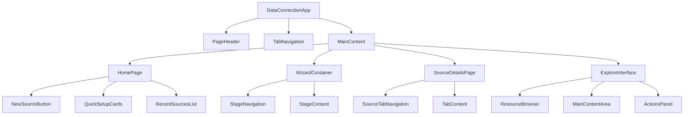

# Data Connection Components - Hierarchy & Relationships

*Last updated: July 22, 2025*

This document outlines the component hierarchy and relationships for the Phoenix Data Connection application, showing how components are nested and interact with each other based on the user guideline and UI specifications.

## Application Architecture Overview



## Component Hierarchy Tree

### 1. Root Application Structure

```
DataConnectionApp
├── PageHeader
│   ├── Title: "Data connection"
│   └── Description: "Synchronize and manage..."
├── TabNavigation
│   ├── SourcesTab (with count indicator)
│   ├── SyncsTab (with count indicator)
│   ├── AgentsTab (with count indicator)
│   └── NewSourceButton
└── MainContent
    ├── HomePage (Sources tab active)
    ├── SyncsPage (Syncs tab active)
    ├── AgentsPage (Agents tab active)
    ├── WizardContainer (New Source flow)
    ├── SourceDetailsPage (Source management)
    └── ExploreInterface (Data exploration)
```

### 2. Home Page Component Tree

```
HomePage
├── WelcomeSection
│   ├── Title: "Data Connection"
│   └── Subtitle: "Synchronize and manage data flows..."
├── QuickSetupCards
│   ├── DataConnectionCard
│   │   └── Description: "Data connection. Synchronize and manage..."
│   ├── CloudServicesCard
│   └── FileSourcesCard
└── RecentSourcesList
    ├── TableHeader
    │   ├── FilesColumn
    │   ├── CreatorColumn
    │   ├── LastEditedByColumn
    │   └── LastViewedColumn
    └── SourceRows[]
        ├── SourceIcon
        ├── SourceName
        ├── ConnectionType (sub-row)
        ├── Creator
        ├── LastEditedBy
        └── LastViewed
```

### 3. Source Creation Wizard Hierarchy

```
WizardContainer
├── WizardHeader
│   └── DynamicTitle: "Untitled" → "Customer Database"
├── StageNavigation (Left Sidebar)
│   ├── Stage1Overview (● active indicator)
│   ├── Stage2Method
│   ├── Stage3Name
│   ├── Stage4Details
│   ├── Stage5Output
│   └── Stage6Summary
├── StageContent (Main Area)
│   ├── Stage1Overview
│   │   ├── WizardIntroduction
│   │   ├── StepsDescription
│   │   ├── ImportantNote
│   │   ├── RequirementsChecklist
│   │   │   ├── ConnectionDetailsItem
│   │   │   ├── AuthCredentialsItem
│   │   │   └── ProjectLocationItem
│   │   └── NavigationButtons
│   │       ├── BackButton
│   │       └── ContinueButton
│   ├── Stage2Method
│   │   ├── MethodTitle: "Choose Connection Method:"
│   │   ├── ConnectionOptions
│   │   │   ├── DirectConnectionCard
│   │   │   │   ├── SelectionIndicator: "✓"
│   │   │   │   ├── MethodTitle
│   │   │   │   └── BenefitsList
│   │   │   │       ├── SimplerSetup
│   │   │   │       ├── NoComponents
│   │   │   │       ├── CloudDatabases
│   │   │   │       └── PublicAPIs
│   │   │   └── AgentConnectionCard
│   │   │       ├── MethodTitle
│   │   │       └── BenefitsList
│   │   │           ├── WorksWithPrivateNetworks
│   │   │           ├── RequiresAgent
│   │   │           ├── EnhancedSecurity
│   │   │           └── OnPremisesData
│   │   └── NavigationButtons
│   ├── Stage3Name
│   │   ├── SourceNameInput
│   │   ├── ProjectSelector
│   │   │   ├── CurrentProjectPath
│   │   │   ├── UseExistingProjectButton
│   │   │   │   └── ProjectDialog
│   │   │   │       ├── ProjectTree
│   │   │   │       ├── NamespaceNodes
│   │   │   │       ├── ProjectNodes
│   │   │   │       ├── CancelButton
│   │   │   │       └── SelectButton
│   │   │   └── CreateNewProjectButton
│   │   │       └── NewProjectDialog
│   │   │           ├── ProjectNameInput
│   │   │           ├── DescriptionInput
│   │   │           ├── LocationDisplay
│   │   │           ├── CancelButton
│   │   │           └── CreateButton
│   │   └── NavigationButtons
│   ├── Stage4Details
│   │   ├── ConnectionForm (Left Column)
│   │   │   ├── HostInput
│   │   │   ├── PortInput
│   │   │   ├── DatabaseInput
│   │   │   ├── UsernameInput
│   │   │   ├── PasswordInput
│   │   │   └── TestConnectionButton
│   │   ├── DataPreviewPanel (Right Column)
│   │   │   ├── LoadingState
│   │   │   │   ├── LoadingSpinner
│   │   │   │   └── LoadingMessage
│   │   │   └── LoadedState
│   │   │       └── ResourceTreePreview
│   │   │           ├── SchemaNodes
│   │   │           ├── TableNodes
│   │   │           └── ColumnNodes
│   │   └── NavigationButtons
│   ├── Stage5Output
│   │   ├── OutputFolderDisplay
│   │   ├── SelectDifferentFolderLink
│   │   │   └── FolderSelectorDialog
│   │   │       ├── FolderTree
│   │   │       ├── NavigationBreadcrumbs
│   │   │       ├── CancelButton
│   │   │       └── SelectButton
│   │   ├── GenerateButton
│   │   │   └── GenerationDialog
│   │   │       ├── FolderStructureList
│   │   │       ├── StatusIndicators
│   │   │       │   ├── ExistingItems: "✓"
│   │   │       │   ├── NewItems: "+"
│   │   │       │   ├── InProgress: "⟳"
│   │   │       │   └── ErrorItems: "!"
│   │   │       ├── LoadingIndicator
│   │   │       └── CloseButton
│   │   └── NavigationButtons
│   └── Stage6Summary
│       ├── ConnectionSummary
│       │   ├── SourceName
│       │   ├── SourceType
│       │   ├── ConnectionMethod
│       │   ├── HostDetails
│       │   ├── ProjectPath
│       │   └── OutputFolderPath
│       ├── NextActionButtons
│       │   ├── ExploreButton
│       │   └── OpenSourceButton
│       └── NavigationButtons
│           ├── BackButton
│           └── FinishButton
└── SourceTypeSelector (Initial Step)
    ├── SearchBox
    └── SourceTypeGrid
        ├── DatabaseCards[]
        ├── CloudServiceCards[]
        ├── FileSourceCards[]
        ├── AnalyticsCards[]
        ├── BusinessAppCards[]
        └── APICards[]
```

### 4. Source Details Page Hierarchy

```
SourceDetailsPage
├── SourceHeader
│   ├── SourceTitle: "Customer Database"
│   ├── SourceType: "PostgreSQL"
│   └── SourceStatus
├── SourceTabNavigation
│   ├── OverviewTab (active highlight)
│   ├── EditSyncsTab
│   ├── ConnectionSettingsTab
│   └── ExploreTab
└── TabContent
    ├── OverviewTab
    │   ├── ConnectionStatus
    │   │   ├── StatusIndicator: "● Active"
    │   │   └── LastUpdated
    │   ├── QuickStats
    │   │   ├── TablesCount
    │   │   ├── ActiveSyncsCount
    │   │   └── LastSyncTime
    │   ├── RecentSyncsList
    │   │   ├── SyncTableHeader
    │   │   └── SyncRows[]
    │   │       ├── SyncName
    │   │       ├── SyncStatus
    │   │       └── NextRunTime
    │   └── CreateBatchSyncButton
    ├── EditSyncsTab
    │   ├── ResourcesPanel (Left)
    │   │   └── ResourceTree
    │   │       ├── SchemaNodes
    │   │       └── TableNodes
    │   ├── ExistingSyncsList (Right)
    │   │   ├── SyncCards[]
    │   │   │   ├── SyncName
    │   │   │   ├── Schedule
    │   │   │   ├── Status
    │   │   │   └── EditButton
    │   │   └── CreateNewSyncButton
    │   └── SyncEditInterface
    │       ├── EditSyncHeader
    │       │   ├── SyncTitle
    │       │   ├── DiscardButton
    │       │   └── SaveButton
    │       ├── SyncEditTabs
    │       │   ├── OverviewTab
    │       │   │   ├── SyncNameInput
    │       │   │   ├── OutputFolderSelector
    │       │   │   └── ResourceProperties
    │       │   └── ConfigurationTab
    │       │       ├── ScheduleSelector
    │       │       ├── TransactionTypeSelector
    │       │       ├── LastRunInfo
    │       │       ├── NextRunInfo
    │       │       ├── StatusDisplay
    │       │       └── RunNowButton
    │       └── MultiSyncManager
    │           ├── SyncSelectionList
    │           └── BatchOperationsPanel
    ├── ConnectionSettingsTab
    │   ├── SettingsNavigation (Left Sidebar)
    │   │   ├── NameLocationSection (active)
    │   │   ├── ConnectionDetailsSection
    │   │   └── OutputFolderSection
    │   ├── SettingsContent (Main Area)
    │   │   ├── NameLocationSection
    │   │   │   ├── SourceNamePanel
    │   │   │   │   ├── SourceNameInput
    │   │   │   │   └── HelpText
    │   │   │   └── ProjectLocationPanel
    │   │   │       ├── CurrentLocationPath
    │   │   │       └── ChangeButton
    │   │   ├── ConnectionDetailsSection
    │   │   │   ├── HostNameInput
    │   │   │   ├── PortInput
    │   │   │   ├── DatabaseNameInput
    │   │   │   ├── AuthenticationInputs
    │   │   │   └── SSLConfigOptions
    │   │   └── OutputFolderSection
    │   │       ├── DefaultOutputFolderPanel
    │   │       │   ├── FolderIcon
    │   │       │   ├── CurrentPath
    │   │       │   └── ChangeDefaultOutputFolderButton
    │   │       └── ExplanationText
    │   └── SaveDiscardButtons
    │       ├── DiscardButton
    │       └── SaveButton
    └── ExploreTab
        → (Links to ExploreInterface)
```

### 5. Explore Interface Hierarchy

```
ExploreInterface
├── ResourceBrowser (Left Sidebar)
│   ├── BreadcrumbNavigation
│   ├── ResourceSearch
│   │   └── SearchInput
│   └── ResourceTree
│       ├── SchemaNodes
│       │   ├── TableNodes
│       │   └── ViewNodes
│       └── FileNodes
│           └── SubfolderNodes
├── MainContentArea (Center)
│   ├── EmptyState (Initial)
│   │   ├── WelcomeMessage
│   │   ├── Instructions
│   │   └── PlaceholderImage
│   ├── LoadingState
│   │   ├── LoadingSpinner
│   │   └── RetrievingMessage
│   └── ResourceDetails (Loaded)
│       ├── ResourceHeader
│       │   ├── ResourceName
│       │   └── ResourceType
│       ├── ResourceMetadata
│       │   ├── RowCount
│       │   ├── ColumnCount
│       │   └── DataSize
│       ├── DataPreview
│       │   ├── PreviewGrid
│       │   │   ├── ColumnHeaders
│       │   │   └── DataRows[]
│       │   └── PaginationControls
│       └── TableDetailsPanel
│           ├── TableSettingsIcon
│           └── DetailsDialog
│               ├── MappingTab (active)
│               │   ├── SelectAllCheckbox
│               │   ├── ColumnMappingTable
│               │   │   ├── ColumnCheckboxes
│               │   │   ├── SourceColumnNames
│               │   │   ├── DestinationColumnInputs
│               │   │   ├── SourceDataTypes
│               │   │   ├── DestinationDataTypeDropdowns
│               │   │   └── NullableToggles
│               │   ├── ResetButton
│               │   ├── SaveButton
│               │   └── CancelButton
│               └── AdvancedTab
│                   ├── TableNameInput
│                   ├── UseFirstRowAsHeadersCheckbox
│                   ├── FieldsDelimiterDropdown
│                   │   ├── CommaOption
│                   │   ├── TabOption
│                   │   ├── SemicolonOption
│                   │   ├── PipeOption
│                   │   ├── SpaceOption
│                   │   └── CustomOption
│                   ├── FieldWrapperDropdown
│                   ├── EscapeCharacterDropdown
│                   ├── DataTypeAnalysisDropdown
│                   │   ├── SmartDetectionOption
│                   │   ├── UseHeaderRowTypesOption
│                   │   ├── StringOnlyOption
│                   │   ├── StrictTypingOption
│                   │   └── CustomMappingOption
│                   ├── ResetButton
│                   ├── SaveButton
│                   └── CancelButton
└── ActionsPanel (Right Sidebar)
    ├── CreateSyncButton
    ├── ResourceInformationPanel
    │   ├── ResourceTypeInfo
    │   └── SchemaInfo
    └── TablePreviewSection
        └── VisualDataRepresentation
```

### 6. Sync Creation Hierarchy

```
SyncCreationInterface
├── SyncHeader
│   └── SyncTitle: "3 New Sync" / "New Sync"
├── SyncContent
│   ├── MultiResourceSync (Multiple resources selected)
│   │   ├── ResourceSelectionList (Left)
│   │   │   ├── ResourceCheckboxes
│   │   │   │   ├── UsersCheckbox
│   │   │   │   ├── OrdersCheckbox
│   │   │   │   └── ProductsCheckbox
│   │   │   └── ResourceNames
│   │   ├── SyncConfigurationForm (Right)
│   │   │   ├── ScheduleSettings
│   │   │   │   ├── ScheduleDropdown
│   │   │   │   │   ├── ManualOption
│   │   │   │   │   ├── HourlyOption
│   │   │   │   │   ├── DailyOption
│   │   │   │   │   └── WeeklyOption
│   │   │   │   ├── ManualScheduleAlert (if Manual selected)
│   │   │   │   └── ScheduleDetails (if Scheduled selected)
│   │   │   ├── TransactionTypeSelector
│   │   │   │   ├── SnapshotOption
│   │   │   │   ├── AppendOption
│   │   │   │   └── UpdateOption
│   │   │   └── TransactionTypeDescriptions
│   │   │       ├── SnapshotDescription
│   │   │       ├── AppendDescription
│   │   │       └── UpdateDescription
│   │   └── CreateSyncsButton
│   └── SingleResourceSync (Single resource selected)
│       ├── SyncTabs
│       │   ├── OverviewTab (active)
│       │   │   ├── SyncNameInput
│       │   │   ├── OutputFolderSelector
│       │   │   │   ├── CurrentFolderPath
│       │   │   │   └── ChangeFolderButton
│       │   │   ├── ResourceProperties
│       │   │   │   ├── ResourceType
│       │   │   │   ├── SchemaInfo
│       │   │   │   ├── RowCount
│       │   │   │   ├── ColumnCount
│       │   │   │   └── DataSize
│       │   │   └── SyncPreview
│       │   │       ├── PreviewGrid
│       │   │       └── SampleData
│       │   └── ConfigurationTab
│       │       ├── ScheduleDropdown
│       │       ├── TransactionTypeSelector
│       │       ├── AdvancedSettings
│       │       │   ├── IncludeColumnHeadersCheckbox
│       │       │   ├── ValidateDataTypesCheckbox
│       │       │   └── SkipEmptyRowsCheckbox
│       │       └── OutputFormatSelector
│       │           ├── ParquetOption
│       │           ├── CSVOption
│       │           └── JSONOption
│       └── FinishButton
└── SyncActionButtons
    └── FinishAndViewSummaryButton
```

## Component Interaction Patterns

### Navigation Flow Relationships

1. **HomePage → WizardContainer**
   - NewSourceButton triggers wizard
   - QuickSetupCards trigger wizard with pre-selected source type

2. **WizardContainer → SourceDetailsPage**
   - OpenSourceButton navigates to source management
   - FinishButton completes wizard and navigates to source

3. **WizardContainer → ExploreInterface**
   - ExploreButton navigates to data exploration

4. **SourceDetailsPage → ExploreInterface**
   - ExploreTab opens explore interface

5. **ExploreInterface → SyncCreationInterface**
   - CreateSyncButton triggers sync creation

6. **SyncCreationInterface → SourceDetailsPage**
   - FinishAndViewSummaryButton returns to source overview

### State Management Relationships

1. **Shared State Components**
   - StageNavigation ↔ StageContent (wizard progression)
   - ResourceBrowser ↔ MainContentArea (resource selection)
   - TabNavigation ↔ TabContent (tab switching)

2. **Parent-Child Data Flow**
   - ResourceTree → ResourceDetails (selection state)
   - ColumnMappingTable → TableDetailsPanel (configuration state)
   - SyncConfigurationForm → SyncCreationInterface (form state)

### Modal/Dialog Relationships

1. **Triggered Dialogs**
   - ProjectSelector → ProjectDialog
   - FolderSelector → FolderSelectorDialog
   - GenerateButton → GenerationDialog
   - TableSettingsIcon → TableDetailsPanel

2. **Dialog Hierarchies**
   - ProjectDialog → ProjectTree → NamespaceNodes → ProjectNodes
   - GenerationDialog → FolderStructureList → StatusIndicators
   - TableDetailsPanel → MappingTab/AdvancedTab → Form Controls

## Component Dependencies

### High-Level Dependencies
```
DataConnectionApp
├── Requires: Mantine UI Components
├── Requires: Effector State Management
├── Requires: BluePrintIcon for icons
└── Requires: Router for navigation

WizardContainer
├── Depends on: StageNavigation state
├── Depends on: Form validation
└── Depends on: Mock data services

ExploreInterface
├── Depends on: Resource tree data
├── Depends on: Data preview services
└── Depends on: Table configuration state

SyncCreationInterface
├── Depends on: Resource selection state
├── Depends on: Schedule configuration
└── Depends on: Output folder state
```

### Shared Component Dependencies
- **NavigationButtons**: Used across all wizard stages
- **SaveDiscardButtons**: Used in settings and sync editing
- **DropdownSelectors**: Used in configuration forms
- **LoadingState**: Used during data fetching operations
- **ResourceTree**: Used in explore and sync editing interfaces

This component hierarchy provides a comprehensive map of how all Data Connection components are structured, nested, and interact with each other throughout the application.

## Component Reusability Analysis

### 🔄 **Highly Reusable Components**

#### **Navigation & Actions**
1. **`NavigationButtons`** - Used across all 6 wizard stages
   - Contains: `BackButton`, `ContinueButton`, `FinishButton`
   - Used in: Stage1-6, dialogs, forms

2. **`SaveDiscardButtons`** - Used in settings and editing interfaces
   - Contains: `SaveButton`, `DiscardButton`
   - Used in: Connection Settings, Sync Editing, Table Details Panel

3. **`TabNavigation`** - Reusable tab switching component
   - Used in: Main app tabs, Source details tabs, Sync creation tabs

#### **Data Display**
4. **`ResourceTree`** - Hierarchical data browser
   - Used in: Explore Interface, Edit Syncs tab, Project dialogs
   - Displays: Schemas → Tables → Columns, or Folders → Files

5. **`LoadingState`** - Loading indicators with spinners
   - Used in: Data preview, resource loading, connection testing
   - Contains: Spinner + loading message

6. **`DataPreview`** - Tabular data display
   - Used in: Explore interface, Sync preview, Connection testing
   - Contains: Grid view, pagination, sample data

#### **Form Controls**
7. **`DropdownSelectors`** - Configurable dropdown menus
   - Used in: Schedule selection, transaction types, data type mapping, field delimiters
   - Highly configurable with different option sets

8. **`SearchBox`** - Search input with filtering
   - Used in: Source type selection, Resource browser, Project dialogs

#### **Status & Indicators**
9. **`StatusIndicator`** - Visual status display
   - Used in: Connection status, sync status, generation progress
   - Shows: ● Active, ⚠ Warning, ✓ Success, ! Error states

10. **`ProgressIndicator`** - Shows completion state
    - Used in: Wizard stages, folder generation, loading processes

### 🔧 **Moderately Reusable Components**

#### **Dialog Components**
11. **`Modal/Dialog Container`** - Base modal wrapper
    - Used in: Project dialogs, Folder selection, Generation dialog, Table details

12. **`FolderSelector`** - Folder browsing interface
    - Used in: Output folder selection, Project location, Sync folder selection

13. **`ProjectSelector`** - Project browsing and selection
    - Used in: Wizard Stage 3, Connection settings

#### **Input Components**
14. **`TextInput`** - Standard text input fields
    - Used in: Source names, host/port/database fields, project names

15. **`Checkbox`** - Checkbox controls
    - Used in: Column selection, advanced settings, resource selection

16. **`RadioButtons`** - Single selection controls  
    - Used in: Connection methods, transaction types, output formats

### 🎯 **Specialized Components** (Less Reusable)

#### **Single-Purpose Components**
17. **`StageNavigation`** - Specific to wizard
18. **`SourceHeader`** - Specific to source details
19. **`QuickSetupCards`** - Specific to home page
20. **`ConnectionForm`** - Specific to connection configuration
21. **`ColumnMappingTable`** - Specific to table configuration

### 📊 **Reusability Categories**

#### **🟢 High Reusability (Used 5+ times)**
- `NavigationButtons`
- `SaveDiscardButtons`
- `DropdownSelectors`
- `LoadingState`
- `StatusIndicator`
- `ResourceTree`
- `SearchBox`

#### **🟡 Medium Reusability (Used 2-4 times)**
- `DataPreview`
- `TabNavigation`
- `FolderSelector`
- `ProjectSelector`
- `TextInput`
- `Checkbox`
- `Modal/Dialog Container`

#### **🔴 Low Reusability (Used 1-2 times)**
- `StageNavigation`
- `SourceHeader`
- `QuickSetupCards`
- `ConnectionForm`
- `ColumnMappingTable`

### 💡 **Implementation Strategy**

#### **Priority 1: Build Core Reusable Components First**
```typescript
// These should be in shared/ui/
- NavigationButtons
- SaveDiscardButtons  
- DropdownSelectors
- LoadingState
- StatusIndicator
- SearchBox
- ResourceTree
```

#### **Priority 2: Form & Input Components**
```typescript
// These should be in shared/ui/
- TextInput
- Checkbox
- RadioButtons
- Modal/Dialog
```

#### **Priority 3: Specialized Reusable Components**
```typescript
// These could be in widgets/ or features/
- DataPreview
- TabNavigation
- FolderSelector  
- ProjectSelector
```

This approach ensures maximum code reuse and consistency across the Data Connection application while following Phoenix's Feature-Sliced Design principles.